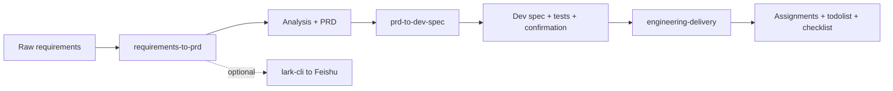

<div align="center">
  <h1>req-to-prd-to-dev-eng-all-skills</h1>
  <p>
    <strong>Requirements → PRD → Dev spec → Engineering delivery</strong><br>
    A monorepo of open <strong>SKILL.md</strong> packs for agents: turn fragmented asks into analyzable requirements and a PRD, then into developer-facing specs and tests, then into assignments, DoD, and delivery checklists. Each subdirectory can be <strong>mounted alone</strong> or used in sequence. Outputs are <strong>Markdown-first</strong> for Cursor, Claude Code, Codex, and similar runtimes.
  </p>
</div>

<p align="center">
  <a href="./README.en.md"></a>
  <a href="./README.md"></a>
</p>

<p align="center">
  <a href="./LICENSE"></a>
  
  
  
</p>

⬇️ [中文](./README.md) · `monorepo` · `skill` · `prd` · `dev-spec` · `engineering`

---

<details open>
<summary><b>Contents</b></summary>

- [What this solves](#what-this-solves)
- [Three-skill pipeline](#three-skill-pipeline)
- [Quick start](#quick-start)
- [Repository layout](#repository-layout)
- [Demo regression chain](#demo-regression-chain)
- [Dependencies](#dependencies)
- [Security & privacy](#security--privacy)
- [Contributing & license](#contributing--license)

</details>

---

## What this solves

Early-stage product work often needs **consistent, traceable documents**—not bullet lists in chat. This repo splits the common path into three mountable skills, each with `SKILL.md`, `references/`, and optional `demo/`:

- **One stage only** — e.g. you already have a PRD → use `prd-to-dev-spec/` alone  
- **Full pipeline** — requirements → PRD → dev spec/tests/confirmation → engineering delivery

---

## Three-skill pipeline



| Step | Directory | Input → output | Notes |
|:--:|-----------|----------------|-------|
| 1 | [requirements-to-prd/](requirements-to-prd/) | Fragments → **analysis + PRD** | EARS/GWT, atomization; **optional** Feishu export |
| 2 | [prd-to-dev-spec/](prd-to-dev-spec/) | Reviewed PRD → **dev spec + tests + confirmation** | FR/AC traceability, UI/control detail, AI extensions |
| 3 | [engineering-delivery/](engineering-delivery/) | Approved materials → **assignments + todolist + checklist** (+ **AI task cards** when coding agents implement) | RACI, DoD, AIC one-at-a-time; DB scripts as drafts only |

See each subdirectory **README** for prompts and layout.

---

## Quick start

### Clone

```bash
git clone https://github.com/Lucky2024-pllove/req-to-prd-to-dev-eng-all-skills.git
cd req-to-prd-to-dev-eng-all-skills
```

Add the **subdirectory you need** to your agent’s skills path (per Cursor / Claude Code docs). You do **not** need to mount the monorepo root.

### Single skill

| Goal | Mount | Sample prompt |
|------|-------|---------------|
| PRD pack | `requirements-to-prd/` | “Use requirements-to-prd SKILL.md for analysis + PRD.” |
| PRD → engineering | `prd-to-dev-spec/` | “Use prd-to-dev-spec for dev spec, tests, confirmation checklist.” |
| Delivery | `engineering-delivery/` | “Use engineering-delivery for assignment plan, todolist, delivery checklist.” |
| Delivery + coding agents | `engineering-delivery/` | “Also output AI-Agent task cards; link implementation todolist items to AIC-xxx.” |

### Full sequence

1. [requirements-to-prd/SKILL.md](requirements-to-prd/SKILL.md)  
2. [prd-to-dev-spec/SKILL.md](prd-to-dev-spec/SKILL.md)  
3. [engineering-delivery/SKILL.md](engineering-delivery/SKILL.md)

---

## Repository layout

```text
req-to-prd-to-dev-eng-all-skills/
├── README.md / README.en.md
├── LICENSE
├── CONTRIBUTING.md
├── SECURITY.md
├── requirements-to-prd/
├── prd-to-dev-spec/
└── engineering-delivery/
```

Typical per-skill contents: `SKILL.md`, `references/`, optional `demo/`, `agents/openai.yaml`, `README.md`.

---

## Demo regression chain

Maintainers can run a lightweight **DailyBill** end-to-end check (structure/traceability, not byte-identical gold files):

| Stage | Path |
|-------|------|
| Requirements → analysis + PRD | [requirements-to-prd/demo/](requirements-to-prd/demo/) |
| PRD → dev tri-pack | [prd-to-dev-spec/demo/](prd-to-dev-spec/demo/) |
| Materials → delivery | [engineering-delivery/demo/](engineering-delivery/demo/) |

---

## Dependencies

| Dependency | Applies to | Required? |
|------------|------------|-----------|
| SKILL.md-capable agent | All | **Yes** |
| [@larksuite/cli](https://github.com/larksuite/cli) | Feishu export in skill 1 only | No |
| Markdown / Mermaid | Reading long outputs | No |

---

## Security & privacy

Do not commit app secrets, tokens, real wiki/tenant IDs, or database connection strings. See [SECURITY.md](SECURITY.md) and per-skill `SECURITY.md` files.

---

## Contributing & license

**Contributors**: [CONTRIBUTORS.md](CONTRIBUTORS.md) (maintainer Lucky-WPL; [Codex](https://github.com/openai/codex) / OpenAI for AI-assisted drafting and optimization).

Issues and PRs welcome — [CONTRIBUTING.md](CONTRIBUTING.md). Skill-specific notes live in each subdirectory’s `CONTRIBUTING.md`.

- **Original work**: root [LICENSE](LICENSE) (**MIT**)  
- **Upstream snapshots** in `requirements-to-prd/references/`: follow upstream licenses — [references/README.en.md](requirements-to-prd/references/README.en.md)

**Disclaimer**: Outputs are planning and engineering coordination aids—not legal, compliance, architecture/security sign-off, or ops approval.
