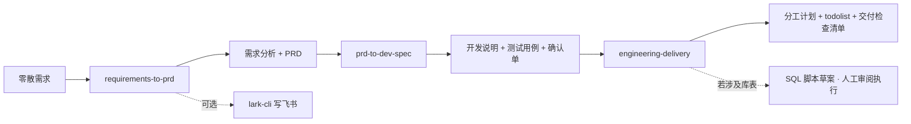

<div align="center">
  <h1>req-to-prd-to-dev-eng-all-skills</h1>
  <p>
    <strong>需求 → PRD → 开发说明 → 工程交付</strong><br>
    一套面向 Agent 的开放 <strong>SKILL.md</strong> <strong>monorepo</strong>：把碎片化需求整理成<strong>需求分析 + PRD</strong>，再落地为<strong>开发说明、测试用例、开发任务确认单</strong>，最后产出<strong>分工计划、todolist、工程交付检查清单</strong>（及按需的数据库脚本草案、AI 任务卡）。<br>
    三个子目录可<strong>单独挂载</strong>，也可按流水线顺序串联；交付物以 <strong>Markdown</strong> 为主，适用于 Cursor、Claude Code、Codex 等环境。
  </p>
</div>

<p align="center">
  <a href="./README.en.md"></a>
  <a href="./README.md"></a>
</p>

<p align="center">
  <a href="./LICENSE"></a>
  
  
  
  <a href="https://github.com/Lucky2024-pllove/req-to-prd-to-dev-eng-all-skills"></a>
</p>

⬇️ [English](./README.en.md) · `monorepo` · `skill` · `prd` · `dev-spec` · `engineering`

---

<details open>
<summary><b>目录</b></summary>

- [它解决什么问题](#它解决什么问题)
- [Before / After](#before--after)
- [三条技能流水线](#三条技能流水线)
- [一句话怎么用](#一句话怎么用)
- [安装与挂载](#安装与挂载)
- [示例对话](#示例对话)
- [仓库结构](#仓库结构)
- [Demo 回归链](#demo-回归链)
- [依赖](#依赖)
- [兼容 Agent](#兼容-agent)
- [安全与隐私](#安全与隐私)
- [免责声明](#免责声明)
- [贡献与许可证](#贡献与许可证)

</details>

---

## 它解决什么问题

从想法到开工，团队常缺的不是「再聊一轮」，而是**结构一致、可追溯、能交接**的文档链：需求是否拆清、PRD 能否验收、研发能否按菜单/接口实现、测试能否对齐 AC、排期前未决项是否收口、发布前 DoD 是否统一。

本仓库把这条链路拆成 **三个可独立使用的 Agent Skill**，共享 MIT 许可与相似的 Markdown 交付风格，避免在单一巨型 prompt 里混杂产品、研发、交付规则。

| 你现在的阶段 | 挂载哪个子目录 |
|--------------|----------------|
| 只有口头/草稿需求 | [requirements-to-prd/](requirements-to-prd/) |
| 已有 PRD，要交给研发 | [prd-to-dev-spec/](prd-to-dev-spec/) |
| 材料已定稿，要分工与交付门禁 | [engineering-delivery/](engineering-delivery/) |

各技能的细则、模板与自检清单位于对应子目录的 [SKILL.md](requirements-to-prd/SKILL.md) 与 [README](requirements-to-prd/README.md)。

---

## Before / After

| | 只在对话里零散输出 | 使用本 monorepo |
|---|-------------------|-----------------|
| **文档链** | 段落重复、口径不一 | 三阶段默认文件名与章节约定 |
| **追溯** | FR、用例、任务对不上 | `FA→FR→AC→模块/TC→任务` 贯穿 |
| **挂载** | 一个大文件夹难维护 | 按阶段只挂一个子目录 |
| **飞书** | 仅第一个技能可选 `lark-cli` | 其余阶段纯 Markdown，无平台绑定 |
| **回归** | 无固定用例 | 三目录 `demo/` 共用 DailyBill 轻量链 |

---

## 三条技能流水线



| 顺序 | 子目录 | 默认产出（文件名含 `{project-name}`） | 要点 |
|:--:|--------|----------------------------------------|------|
| **1** | [requirements-to-prd/](requirements-to-prd/) | 需求分析文档、PRD | EARS/GWT、功能原子化、MVP/Out of Scope；**可选**飞书归档 |
| **2** | [prd-to-dev-spec/](prd-to-dev-spec/) | 开发说明文档、测试用例、开发任务确认单 | 菜单/控件级细节、伪代码/Mermaid、AI Prompt 包草案 |
| **3** | [engineering-delivery/](engineering-delivery/) | 开发分工计划、todolist、工程交付检查清单；（**AI 编码时** + AI-Agent 任务卡） | RACI、DoD/门禁、ADR；AIC 一次一卡；DB **只出脚本草案**，不连目标库 |

---

## 一句话怎么用

**走完整流水线：**

```
我有一段产品需求（如下）。请按顺序使用本仓库技能：
1) requirements-to-prd 输出需求分析 + PRD；
2) prd-to-dev-spec 基于 PRD 输出开发说明、测试用例、开发任务确认单；
3) engineering-delivery 基于上述定稿材料输出分工计划、todolist、工程交付检查清单；若由编码 Agent 实现，另输出 AI-Agent 任务卡且 todolist 实现项链接 AIC。
项目名：xxx。默认只在对话输出 Markdown，不要假设已写飞书或已执行数据库。
```

**只用一个阶段：** 在提示中明确子目录名即可，例如「请只按 prd-to-dev-spec 的 SKILL.md …」。

---

## 安装与挂载

```bash
git clone https://github.com/Lucky2024-pllove/req-to-prd-to-dev-eng-all-skills.git
cd req-to-prd-to-dev-eng-all-skills
```

| 步骤 | 说明 |
|------|------|
| **挂载** | 将需要的**子目录**（非仓库根）加入 Agent 的 skills 路径 — 详见 Cursor / Claude Code 等官方文档 |
| **阅读** | 执行前打开对应 [SKILL.md](requirements-to-prd/SKILL.md)；复杂规则按需读 `references/` |
| **飞书** | 仅 [requirements-to-prd](requirements-to-prd/) 需要 `@larksuite/cli` 与飞书应用授权 |

---

## 示例对话

| 目标 | 示例提示 |
|------|----------|
| 只要 PRD | 「需求：……请按 requirements-to-prd 输出需求分析文档和 PRD，两份文件名带项目名。」 |
| PRD → 研发三件套 | 「PRD 如下……请按 prd-to-dev-spec 产出开发说明、测试用例、确认单。」 |
| 工程交付 | 「开发说明与测试用例已定稿……请按 engineering-delivery 生成分工计划、todolist、交付检查清单。」 |
| 工程交付 + 编码 Agent | 「……另输出 AI-Agent 任务卡；实现类任务链 AIC；一次只执行一张卡。」 |
| 含库表变更 | 「……若涉及表结构变更，只附迁移/回滚/校验 SQL 草案，不要连接数据库。」 |
| PRD 未基线 | 「PRD 仍在评审，请各阶段输出但标注草案，并在确认单/检查清单列阻塞项与 owner。」 |

更多示例见各子目录 README 的「示例对话」节。

---

## 仓库结构

```text
req-to-prd-to-dev-eng-all-skills/
├── README.md / README.en.md     # 本说明（流水线总览）
├── LICENSE                      # MIT
├── CONTRIBUTING.md              # monorepo 贡献说明
├── SECURITY.md                  # 安全策略总览
├── requirements-to-prd/         # 技能 1 · 见子目录 README
├── prd-to-dev-spec/             # 技能 2
└── engineering-delivery/        # 技能 3
```

每个子目录通常包含：`SKILL.md`、`references/`、`demo/`（维护者回归）、`agents/openai.yaml`、子级 `README` / `CONTRIBUTING` / `SECURITY`。

---

## Demo 回归链

维护者可用 **DailyBill** 用例做结构回归（**不必与金样逐字相同**，但 FR/AC/TC 追溯应一致）：

| 阶段 | 路径 |
|------|------|
| 需求 → 分析 + PRD | [requirements-to-prd/demo/](requirements-to-prd/demo/) |
| PRD → 开发三件套 | [prd-to-dev-spec/demo/](prd-to-dev-spec/demo/) |
| 材料 → 工程交付 | [engineering-delivery/demo/](engineering-delivery/demo/) |

---

## 依赖

| 依赖 | 适用技能 | 必需？ |
|------|----------|--------|
| 支持 **SKILL.md** 的 Agent | 全部 | **是** |
| [@larksuite/cli](https://github.com/larksuite/cli) | 仅 requirements-to-prd 写飞书 | 否 |
| Markdown / Mermaid（可选） | 阅读长篇交付物 | 否 |

本仓库**不包含**项目管理 SaaS、CI 产品或数据库客户端；门禁与脚本需结合你方环境落地。

---

## 兼容 Agent

开放 `SKILL.md` 形式，**不绑定**单一 IDE 或厂商。常见用法：clone 后将**某一子目录**放入项目或全局 skills 路径。若运行时无法挂载 `references/`，请在对话中要求 Agent 内联关键规则片段（各 SKILL 均有 Agent Compatibility 说明）。

---

## 安全与隐私

公开仓库**不得**提交：

| 类别 | 说明 |
|------|------|
| 飞书密钥与 token | 见 [requirements-to-prd/SECURITY.md](requirements-to-prd/SECURITY.md) |
| API / 模型 / DB 密钥 | 见 [prd-to-dev-spec/SECURITY.md](prd-to-dev-spec/SECURITY.md)、[engineering-delivery/SECURITY.md](engineering-delivery/SECURITY.md) |
| 本地覆盖 | `*.local.md`、`.env*` — 见根 [.gitignore](.gitignore) |

总览：[SECURITY.md](SECURITY.md)

---

## 免责声明

本仓库各技能产出均为**规划、研发交接与工程协作辅助材料**，不能替代业务决策、法务合规、架构/安全评审、变更管理或运维审批；数据库脚本的正确性与执行须由人工在你方环境验证。

---

## 贡献与许可证

**贡献者**：[CONTRIBUTORS.md](CONTRIBUTORS.md)（维护者 Lucky-WPL；[Codex](https://github.com/openai/codex) / OpenAI 参与 AI 辅助起草与优化）。

欢迎 Issue / PR。流程见 [CONTRIBUTING.md](CONTRIBUTING.md)；各技能另有：

- [requirements-to-prd/CONTRIBUTING.md](requirements-to-prd/CONTRIBUTING.md)
- [prd-to-dev-spec/CONTRIBUTING.md](prd-to-dev-spec/CONTRIBUTING.md)
- [engineering-delivery/CONTRIBUTING.md](engineering-delivery/CONTRIBUTING.md)

- **本仓库原创部分**：根目录 [LICENSE](LICENSE) **MIT**
- **`requirements-to-prd/references/` 上游快照**：遵循各自原许可证 — [references/README.md](requirements-to-prd/references/README.md)
