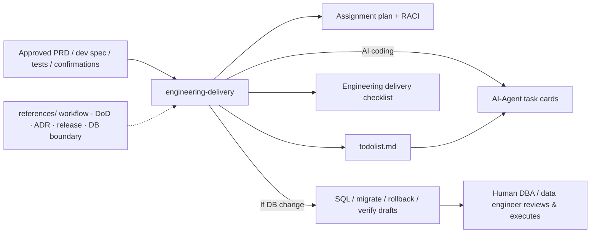

<div align="center">
  <h1>engineering-delivery</h1>
  <p>
    <strong>Baselined PRD / dev spec / tests / confirmation → engineering execution &amp; collaboration artifacts</strong><br>
    An open <strong>SKILL.md</strong> for agents: once product and technical materials are <strong>aligned and approved</strong>, produce actionable <strong>development assignment plans</strong>, <strong>RACI</strong>, <strong>todolist.md</strong>, <strong>Definition of Done</strong>, quality gates, ADR suggestions, review and release/rollback checklists, and <strong>engineering collaboration rules</strong>. For database changes, generate <strong>SQL / migration / rollback / verification script drafts only</strong>—human DBAs or data engineers review and execute them; agents must not connect to target databases. Outputs are plain Markdown-first for reuse in Codex, Claude Code, Cursor, and similar environments.
  </p>
</div>

<p align="center">
  <a href="./README.en.md"></a>
  <a href="./README.md"></a>
</p>

<p align="center">
  <a href="./LICENSE"></a>
  
  
  
</p>

⬇️ [中文](./README.md) · `skill` · `engineering` · `delivery` · `agent-agnostic`

---

<details open>
<summary><b>Table of contents</b></summary>

- [What it solves](#what-it-solves)
- [Before / After](#before--after)
- [One-liner prompt](#one-liner-prompt)
- [Workflow (summary)](#workflow-summary)
- [Install & prerequisites](#install--prerequisites)
- [How to use](#how-to-use)
- [Example prompts](#example-prompts)
- [Repository layout](#repository-layout)
- [Dependencies](#dependencies)
- [Agent compatibility](#agent-compatibility)
- [Security & privacy: do not commit](#security--privacy-do-not-commit)
- [Disclaimer](#disclaimer)
- [Contributing & license](#contributing--license)

</details>

---

## What it solves

After the PRD, development specification document, detailed test cases, and development-task confirmation checklist are finalized, teams still need <strong>actionable tasks</strong>, clear <strong>accountability (RACI)</strong>, an agreed <strong>Definition of Done</strong>, and <strong>quality gates</strong> (tests, CI, code review, etc.), plus checklists for <strong>release, rollback, and delivery packages</strong>. Material architecture, data, security, AI, or deployment decisions call for <strong>ADR</strong>-style suggestions and a review cadence. Database work needs a <strong>reviewable script bundle</strong>—not chat messages that assume execution already happened.

**engineering-delivery** encodes in `SKILL.md`: approved inputs are the single source of truth; every task traces to FR/AC/TC or a documented engineering prerequisite; planning depth follows S/M/L sizing; database work <strong>produces script drafts only</strong> (see `SKILL.md`, Hard Rules and Workflow).

---

## Before / After

| | Scheduling by word of mouth only | With this skill |
|---|----------------------------------|-----------------|
| **Task shape** | Unclear ownership, easy to miss dependencies | RACI, milestone grouping, dependency table/diagram, risk register |
| **Done criteria** | “It’s done” means different things | DoD, quality gates, review checklists |
| **Architecture / data calls** | Lost in chat history | ADR suggestions and review entry points |
| **Databases** | Verbal intent or ad hoc SQL | Migration / rollback / verification drafts + explicit human-execution boundary |
| **Multi-agent setups** | Inconsistent formats | Plain Markdown, Mermaid, checklists readable across tools |

---

## One-liner prompt

**Human-led scheduling (default triad):**

```
Use the following as the development baseline: PRD, development specification, test cases, and
development-task confirmation checklist. Follow engineering-delivery’s SKILL.md and output:
{project-name}-开发分工计划.md, {project-name}-todolist.md, {project-name}-工程交付检查清单.md.
If schema/table changes apply, add migration/rollback/verification SQL drafts only—no DB connection or execution.
```

**Handoff to coding agents (quad + task cards):**

```
Same inputs. Also output {project-name}-AI-Agent任务卡.md with AIC-xxx cards (read-first paths, allowed/forbidden
scope, validation commands, completion criteria). Link every implementation todolist item to an AIC. One card at a time;
stop if blockers/Open Questions are unresolved.
```

If inputs are not formally approved, require the agent to label outputs clearly as <strong>execution drafts based on unapproved inputs</strong> (aligned with intake rules in `SKILL.md`).

---

## Workflow (summary)



---

## Install & prerequisites

| Requirement | Role | Mandatory? |
|-------------|------|------------|
| An agent that supports **SKILL.md** (Cursor, Claude Code, Codex, …) | Load and execute this skill | **Yes** |
| <strong>Aligned</strong> PRD / dev spec / tests / confirmation materials | Factual baseline for tasks and gates | **Strongly recommended** |

**Recommendation**: Add this folder to your agent skill scan path or `git clone` it next to your project. Open the relevant guides under `references/` as needed (team workflow, DoD/gates, ADR, release handoff, database change boundaries, cross-agent compatibility).

---

## How to use

### 1. Standard: assignments and todolist from baselined materials

Provide project name, full documents or paths, and whether the baseline is approved; ask for the default deliverable file names plus Markdown bodies. If the agent cannot write files, require chunked output of `filename` + body per `SKILL.md` (Agent Compatibility).

### 2. Database changes: drafts only—no execution

State environments (dev/staging/prod) and scope; enforce `references/database-change-control.md` and the “generate scripts only, no target-database connectivity” rule in `SKILL.md`.

### 3. Large or cross-team efforts: engage S/M/L plus ADR / release

For Level L work (new subsystem, cross-service, data/security/deploy), ask for RACI, quality gates, release/rollback, and ADR suggestions, citing `references/dod-quality-gates.md`, `references/adr-architecture.md`, and `references/release-handoff.md`.

---

## Example prompts

| Goal | Example |
|------|---------|
| Human scheduling triad | “Run engineering-delivery: assignment plan, todolist, engineering delivery checklist; project xxx.” |
| **Coding-agent quad** | “Cursor will implement—also output AI-Agent task cards; link implementation todolist items to AIC-xxx; one card at a time.” |
| RACI + milestones | “Include RACI, tasks grouped by milestone, and a dependency table.” |
| DB change | “Order table expansion—give migration/rollback/verification SQL drafts and a human execution checklist; do not connect to a database.” |
| Agent artifacts | “Our dev spec includes agent workflows and prompt packages—assign review owners and gates.” |
| Unapproved baseline | “Docs still in review—still output, but mark as unapproved draft and list blockers with owners.” |

---

## Repository layout

| Path | Description |
|------|-------------|
| [SKILL.md](SKILL.md) | Main skill: intake, task sizing, assignments, todolist, checklist, DB script boundaries |
| [references/](references/) | Team workflow, DoD/gates, ADR, database change control, release handoff, cross-agent notes |
| [demo/](demo/README.md) | Fixed inputs and lightweight gold samples for assignment/todolist/checklist + [TEST-RUN.md](demo/TEST-RUN.md) |
| [agents/openai.yaml](agents/openai.yaml) | Example capability declaration for OpenAI Agents / SDK-style hosts (adapt as needed) |
| [README.md](README.md) / [README.en.md](README.en.md) | This documentation (ZH / EN) |
| [CONTRIBUTING.md](CONTRIBUTING.md) / [SECURITY.md](SECURITY.md) | Contribution guide and security policy |
| [LICENSE](LICENSE) | MIT |

---

## Dependencies

| Dependency | Role | Mandatory? |
|------------|------|------------|
| SKILL.md-capable agent | Run this skill in conversation | **Yes** |
| Markdown / Mermaid viewer (optional) | Read long deliverables comfortably | No |

This repository does <strong>not</strong> ship a specific CI product or database client; wire gates and scripts into your pipelines and ops standards.

---

## Agent compatibility

The skill ships as open `SKILL.md` content and is <strong>not</strong> tied to one vendor. Place the folder per your IDE/agent docs (Cursor, Claude Code, etc.). If `references/` cannot be mounted, ask the responder to inline the critical rule excerpts.

---

## Security & privacy: do not commit

| Category | Notes |
|---------|-------|
| **Connection strings & secrets** | Database URLs, passwords, cloud credentials—configure only in secure channels; avoid pasting live secrets into public doc bodies. |
| **Production identifiers** | Real database names, internal hosts, tenant-scoped IDs—use placeholders when sharing broadly. |
| **Secrets in scripts** | Avoid embedding keys in migration scripts; prefer parameterized runs or your secret manager (common hygiene for supply-chain and compliance). |

---

## Disclaimer

Artifacts are <strong>aids for engineering coordination and delivery planning</strong>. They do not replace project-management decisions, legal/compliance rulings, change-advisory boards, or operations approvals—teams must still confirm outcomes. Correctness, performance, and transactional safety of SQL drafts depend on human review and validation <strong>in your environments</strong>.

---

## Contributing & license

Issues and PRs welcome for wording, prompts, RACI layouts, gate lists, or database-script templates. See [CONTRIBUTING.md](CONTRIBUTING.md) and [SECURITY.md](SECURITY.md).

Licensing defaults to MIT in the root [LICENSE](LICENSE).
