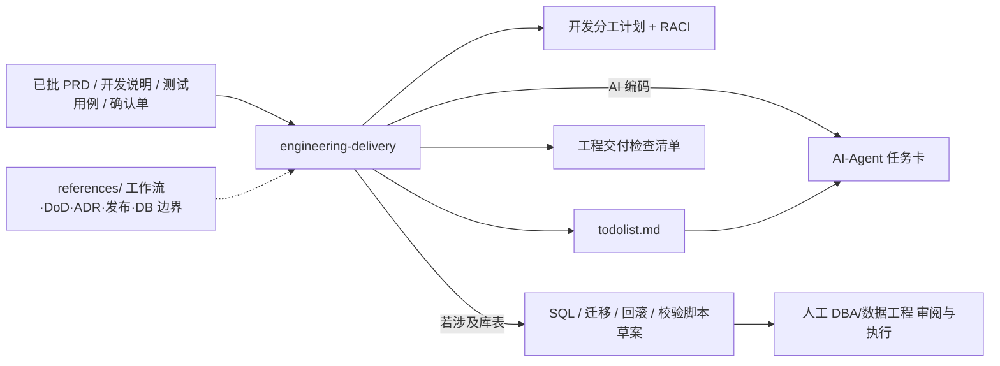

<div align="center">
  <h1>engineering-delivery</h1>
  <p>
    <strong>已定稿 PRD / 开发说明 / 测试用例 / 开发确认 → 工程执行与协作产物</strong><br>
    面向 Agent 的开放 <strong>SKILL.md</strong>：在产品与技术面材料<strong>已对齐并批准</strong>后，产出可执行的<strong>开发分工计划</strong>、<strong>RACI</strong>、<strong>todolist.md</strong>、<strong>Definition of Done</strong>、质量门禁、ADR 建议、评审与发布/回滚检查项，以及<strong>工程协作规则</strong>。涉及数据库变更时，仅生成 <strong>SQL / 迁移 / 回滚 / 校验脚本草案</strong>，由人工 DBA/数据工程审阅与执行，Agent 不直连目标库。输出以纯 Markdown 为主，便于在 Codex、Claude Code、Cursor 等环境中复用。
  </p>
</div>

<p align="center">
  <a href="./README.en.md"></a>
  <a href="./README.md"></a>
</p>

<p align="center">
  <a href="./LICENSE"></a>
  
  
  
</p>

⬇️ [English](./README.en.md) · `skill` · `engineering` · `delivery` · `agent-agnostic`

---

<details open>
<summary><b>目录</b></summary>

- [它解决什么问题](#它解决什么问题)
- [Before / After](#before--after)
- [一句话怎么用](#一句话怎么用)
- [工作流程摘要](#工作流程摘要)
- [安装与前置条件](#安装与前置条件)
- [使用方式](#使用方式)
- [示例对话](#示例对话)
- [文件结构](#文件结构)
- [依赖](#依赖)
- [兼容 Agent](#兼容-agent)
- [安全与隐私：不要提交的内容](#安全与隐私不要提交的内容)
- [免责声明](#免责声明)
- [贡献与许可证](#贡献与许可证)

</details>

---

## 它解决什么问题

PRD、开发说明文档、测试用例与开发任务确认单定稿后，团队仍需要<strong>可执行任务</strong>、<strong>责任边界（RACI）</strong>、<strong>完成的统一定义（DoD）</strong>与<strong>门禁</strong>（测试、CI、代码评审等），以及<strong>发布 / 回滚 / 交付包</strong>层面的检查清单。若存在架构或数据、安全、AI、部署等重大决策，还需要形成 <strong>ADR</strong> 建议与评审节奏。涉及数据库时，需要<strong>可审阅的脚本包</strong>，而不是在对话里“假设已执行”。

**engineering-delivery** 在 `SKILL.md` 中约定：以已批准材料为唯一事实来源、任务须可追溯至 FR/AC/TC 或工程前提、按 S/M/L 任务级别选择规划深度、数据库工作<strong>只产出脚本草案</strong>（推断来源：`SKILL.md` 中 Hard Rules 与 Workflow 章节）。

---

## Before / After

| | 只靠口头排期 | 使用本技能 |
|---|--------------|------------|
| **任务结构** | 谁做什么不清楚、依赖易漏 | RACI、里程碑分组、依赖表/图、风险登记 |
| **完成标准** | “做完了”难统一 | DoD、质量门禁、评审清单 |
| **架构/数据决策** | 散落在聊天记录 | ADR 建议与评审入口 |
| **数据库** | 口述或临时 SQL | 迁移/回滚/校验脚本草案 + 人工执行边界 |
| **多 Agent 环境** | 格式不统一 | 纯 Markdown、Mermaid、检查表，跨工具可读 |

---

## 一句话怎么用

**人排期（默认三件套）：**

```
以下材料已（或拟）作为开发基线：PRD、开发说明、测试用例、开发任务确认单（粘贴或路径如下）。
请按 engineering-delivery 的 SKILL.md 输出：{project-name}-开发分工计划.md、{project-name}-todolist.md、
{project-name}-工程交付检查清单.md。若涉及库表变更，另附 SQL/迁移/回滚/校验脚本草案，不要连接或执行任何数据库。
```

**交给编码 Agent / vibe coding（四件套）：**

```
同上材料。另须输出 {project-name}-AI-Agent任务卡.md：每张 AIC 含先读再改、允许/禁止路径、验证命令、完成标准；
todolist 中每条实现类任务链接 AIC-xxx。一次只执行一张任务卡；OQ/阻塞未关闭则停止实现。
```

若输入尚未正式批准，要求在输出中明确标注为<strong>基于未批准输入的执行草案</strong>（与 `SKILL.md` 的 Intake 约定一致）。

---

## 工作流程摘要



---

## 安装与前置条件

| 条件 | 用途 | 是否必需 |
|------|------|----------|
| 支持 **SKILL.md** 的 Agent（Cursor、Claude Code、Codex 等） | 解析并执行本技能 | **是** |
| **已对齐的** PRD / 开发说明 / 测试用例 / 开发确认材料 | 作为任务与门禁的输入事实来源 | **强烈推荐** |

**推荐**：将本目录加入 Agent 的 skills 扫描路径，或 `git clone` 到项目旁使用。按需打开 `references/` 中对应专题（团队工作流、DoD/门禁、ADR、发布交接、数据库变更边界、跨 Agent 兼容性）。

---

## 使用方式

### 1. 标准：从已定稿材料生成分工与 todolist

提供项目名、材料全文或路径，说明基线是否已批准；说明是否由 **AI 编码 Agent** 实现（是则须四件套含任务卡）。要求输出约定文件名与 Markdown 正文。若 Agent 无法写文件，要求其按 `SKILL.md` 的 Agent Compatibility 约定在对话中分段给出「文件名 + 正文」。

### 2. 含数据库变更：只要脚本草案，不要执行

明确环境（dev/staging/prod）与变更范围；要求严格遵循 `references/database-change-control.md` 与 `SKILL.md` 中「仅生成脚本、不连目标库」的边界。

### 3. 大型或跨团队：打开 S/M/L 与 ADR / 发布章节

对 L 级（新子系统、跨服务、数据/安全/部署）任务，要求补齐 RACI、质量门禁、发布/回滚与 ADR 建议，并引用 `references/dod-quality-gates.md`、`references/adr-architecture.md`、`references/release-handoff.md`。

---

## 示例对话

| 目标 | 示例提示 |
|------|----------|
| 人排期三件套 | 「请按 engineering-delivery 生成分工计划、todolist、工程交付检查清单，项目名 xxx。」 |
| **编码 Agent 四件套** | 「将由 Cursor 实现；请输出分工计划、todolist、检查清单及 AI-Agent任务卡；实现类 todolist 链 AIC；一次一卡。」 |
| RACI + 里程碑 | 「请附 RACI、按里程碑分组任务、依赖表；任务表含优先级、估时、完成标准。」 |
| DB 变更 | 「包含订单表扩展，请给出迁移/回滚/校验 SQL 草案及人工执行检查项，不要连接数据库。」 |
| Agent 产物评审 | 「开发说明里含 Agent 工作流与 Prompt 包，请分配评审 owner 与门禁。」 |
| 未批基线 | 「材料仍在评审，请输出但标注为未批准草案，并列出阻塞项与 owner。」 |

---

## 文件结构

| 路径 | 说明 |
|------|------|
| [SKILL.md](SKILL.md) | 主技能：摄入、任务分级、分工、todolist、检查清单、DB 脚本边界 |
| [references/](references/) | 团队工作流、DoD/门禁、ADR、数据库变更控制、发布交接、跨 Agent 说明 |
| [demo/](demo/README.md) | 固定输入与分工/todolist/检查清单/**AI 任务卡**金样、[TEST-RUN.md](demo/TEST-RUN.md) |
| [agents/openai.yaml](agents/openai.yaml) | OpenAI Agents /SDK 等形式的能力声明示例（可按需适配） |
| [README.md](README.md) / [README.en.md](README.en.md) | 本说明（中/英） |
| [CONTRIBUTING.md](CONTRIBUTING.md) / [SECURITY.md](SECURITY.md) | 贡献指南与安全策略 |
| [LICENSE](LICENSE) | MIT |

---

## 依赖

| 依赖 | 用途 | 必需？ |
|------|------|--------|
| 支持 SKILL.md 的 Agent | 对话执行本技能 | **是** |
| Markdown / Mermaid 渲染（可选） | 阅读长篇交付物 | 否 |

本仓库<strong>不包含</strong>具体 CI 产品或数据库客户端；门禁与脚本需结合你方流水线与运维规范落地。

---

## 兼容 Agent

本技能为开放 `SKILL.md` 形式，**不绑定**单一产品。将本文件夹置于项目目录或全局 skills 目录（具体路径以各 Agent 官方文档为准）。若运行时无法挂载 `references/`，请要求在对话中内联引用关键规则段落。

---

## 安全与隐私：不要提交的内容

| 类别 | 说明 |
|------|------|
| **连接串与密钥** | 数据库 URL、密码、云服务访问密钥等；仅在安全环境中配置，勿写入公开文档正文。 |
| **生产标识** | 真实库名、内网主机、租户级 ID；公开分享时用占位符。 |
| **凭据混入脚本** | 迁移脚本中硬编码密钥；改用参数化或密钥管理。**推断**：属于常见供应链与合规风险做法。 |

---

## 免责声明

本 Skill 产出为<strong>工程协作与交付组织辅助材料</strong>，不能替代项目管理决策、法务合规、变更管理委员会或运维审批；关键结论仍须由团队评审确认。数据库脚本的<strong>正确性、性能与一致性</strong>以人工评审与在你的环境中验证为准。

---

## 贡献与许可证

欢迎通过 Issue / PR 修订文档结构与示例提示。细则见 [CONTRIBUTING.md](CONTRIBUTING.md)；安全见 [SECURITY.md](SECURITY.md)。

本仓库默认以根目录 [LICENSE](LICENSE) **MIT License** 为准。
