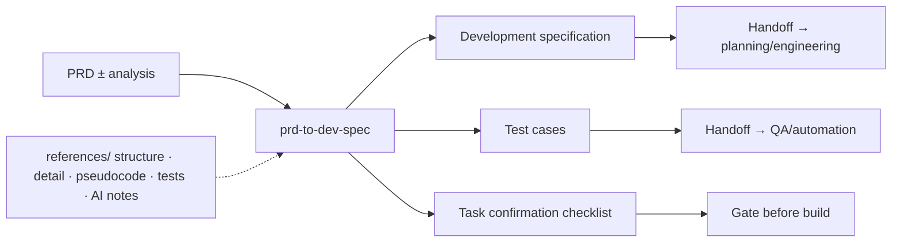

<div align="center">
  <h1>prd-to-dev-spec</h1>
  <p>
    <strong>Reviewed / baselined PRD (+ optional analysis) → dev spec · tests · confirmation checklist</strong><br>
    An open <strong>SKILL.md</strong> for agents that turns stakeholder-ready PRDs into engineering-facing <strong>development specifications</strong>, <strong>detailed test cases</strong> anchored to acceptance logic, and a <strong>pre-start confirmation checklist</strong>. It reinforces <strong>FR/AC traceability</strong>, module &amp; navigation decomposition, controls plus button semantics, business/data logic, APIs and data contracts, illustrative <strong>pseudocode</strong> plus <strong>Mermaid</strong> diagrams, and—when AI work is involved—expanded <strong>agent workflows</strong>, <strong>R&amp;R splits</strong>, <strong>prompt package drafts</strong>, deployment/monitoring cues. Outputs stay Markdown-first so Codex, Claude Code, Cursor, and peers can collaborate without bespoke tooling beyond optional skill loaders.
  </p>
</div>

<p align="center">
  <a href="./README.en.md"></a>
  <a href="./README.md"></a>
</p>

<p align="center">
  <a href="./LICENSE"></a>
  
  
  
</p>

⬇️ [中文](./README.md) · `skill` · `dev-spec` · `test-design` · `agent-agnostic`

---

<details open>
<summary><b>Table of contents</b></summary>

- [What it solves](#what-it-solves)
- [Before / After](#before--after)
- [One-liner prompt](#one-liner-prompt)
- [Flow (summary)](#flow-summary)
- [Prerequisites & install](#prerequisites--install)
- [How to use](#how-to-use)
- [Example prompts](#example-prompts)
- [Repository layout](#repository-layout)
- [Dependencies](#dependencies)
- [Agent compatibility](#agent-compatibility)
- [Security & privacy: do not commit](#security--privacy-do-not-commit)
- [Disclaimer](#disclaimer)
- [Contributing & license](#contributing--license)

</details>

---

## What it solves

Once a PRD is approved, engineering and QA still need implementable **module/menu/API/data designs**, executable **tests tied to acceptance criteria**, and a **gatekeeping checklist** that closes open questions before coding starts. AI-heavy programs also need PRD prose translated into **workflow boundaries, tool/data permissions, prompt shapes, and operational fallbacks**—otherwise implementation becomes guesswork.

**prd-to-dev-spec** encodes the default tri-doc package, traceability chain `FA → FR → AC → modules/APIs/tests/tasks`, and the explicit “draft on unbaselined PRD” disclaimer (sources: opening sections & Operating Rules in `SKILL.md`).

---

## Before / After

| | PRD paragraphs only | With this skill |
|---|---------------------|-----------------|
| **Granularity** | Fuzzy features | Control-level specs + biz/data sections |
| **Acceptance** | Drift vs build | Cases explicitly map to AC/spec logic |
| **Pre-start gate** | Verbal thumbs-up | Confirmation sheet with unresolved items + owners |
| **AI programs** | Marketing language | Workflow diagrams, prompt packages, evaluation notes |
| **Multi-agent setups** | Format chaos | Shared Markdown conventions |

---

## One-liner prompt

```
Attached is my reviewed PRD (+ optional requirement analysis pasted below).
Follow prd-to-dev-spec SKILL.md and emit three Markdown deliverables named exactly like the skill:
{project-name}-开发说明文档.md,
{project-name}-测试用例.md,
{project-name}-开发任务确认单.md.
If the PRD isn’t baselined, annotate the draft accordingly and enumerate blocking questions plus suggested owners—per SKILL intake rules.
```

---

## Flow (summary)



---

## Prerequisites & install

| Prerequisite | Role | Required? |
|--------------|------|-----------|
| Agent with **SKILL.md** loaders | Executes instructions | **Yes** |
| **PRD** (baselining preferred) | Scope + acceptance source | **Yes** |
| Requirement analysis attachments | Nuanced context/trade-offs | Optional |

Recommended: symlink or copy this repo into each agent vendor’s skill directory layout. Consultants should skim `references/dev-spec-structure.md`, `references/function-detail-guide.md`, `references/pseudocode-guide.md`, `references/test-case-design.md`, `references/task-confirmation.md`, and `references/ai-implementation.md` as prompts demand.

---

## How to use

### 1. Default: coordinated tri-doc drop

Paste the PRD (with version + project labels). Require full adherence to `SKILL.md` sections and traceability tables; tests must stem from AC + technical logic rather than paraphrased marketing copy.

### 2. PRD still in review

Force visible “draft on unbaselined PRD” stamps, risk notes, and owner proposals per `SKILL.md`.

### 3. AI-heavy scope

When PRD sections mention agents/tools/models, insist on Section 13 depth (workflows, prompt packages, eval/fallback) using `references/ai-implementation.md`.

### 4. File writes unavailable

Follow `SKILL.md` agent compatibility: stream `filename` headers plus Markdown bodies directly in chat.

---

## Example prompts

| Goal | Sample prompt |
|------|---------------|
| Tri-pack | “Project xxx PRD below—generate dev spec, tests, confirmation sheet via prd-to-dev-spec.” |
| Trace grid | “Append FR/AC/TC tables after every functional subsection.” |
| UI fidelity | “Document every Login page control state transitions.” |
| Agents | “Add sequence diagram plus prompt bundle + evaluation field list for approvals agent.” |
| Not baselined | “PRD v0.9—still produce artifacts but checklist must block unresolved API ownership.” |

---

## Repository layout

| Path | Description |
|------|-------------|
| [SKILL.md](SKILL.md) | Canonical rules, workflows, pseudocode prompts, portability notes |
| [references/](references/) | Supplemental doctrine for structure/detail/tests/AI augmentation |
| [demo/](demo/README.md) | Fixed PRD input and lightweight gold samples for the tri-pack + [TEST-RUN.md](demo/TEST-RUN.md) |
| [agents/openai.yaml](agents/openai.yaml) | Example provider manifest for hosts that ingest YAML manifests |
| [README.md](README.md) / [README.en.md](README.en.md) | Localization pair |
| [CONTRIBUTING.md](CONTRIBUTING.md) / [SECURITY.md](SECURITY.md) | Contribution guide and security policy |
| [LICENSE](LICENSE) | MIT |

---

## Dependencies

| Dependency | Purpose | Mandatory? |
|------------|---------|------------|
| SKILL-compatible agent runtime | Applies instructions end-to-end | **Yes** |
| Markdown/Mermaid preview (optional) | Human readability polish | No |

No bundled proprietary PM/test SaaS—you can import Markdown outputs into whichever ALM tooling you operate.

---

## Agent compatibility

`SKILL.md` remains vendor-neutral; mounting strategy depends on Cursor/Claude Code/Codex documentation. Without `references/`, explicitly ask the responder to paste critical guardrails inline.

---

## Security & privacy: do not commit

| Category | Notes |
|---------|-------|
| **Secrets** | API keys, model tokens, production credentials stay out of shared specs. |
| **PII samples** | Use synthetic or scrubbed fixtures in examples. |

---

## Disclaimer

Documents are **planning aids**—not legal sign-off, security certification, or operational guarantees. Engineering must still validate designs against real systems and policies.

---

## Contributing & license

Improvements to templates, bilingual README examples, or compatibility tips are welcome via PR. See [CONTRIBUTING.md](CONTRIBUTING.md) and [SECURITY.md](SECURITY.md).

Licensing defaults to MIT as listed in [LICENSE](LICENSE).
