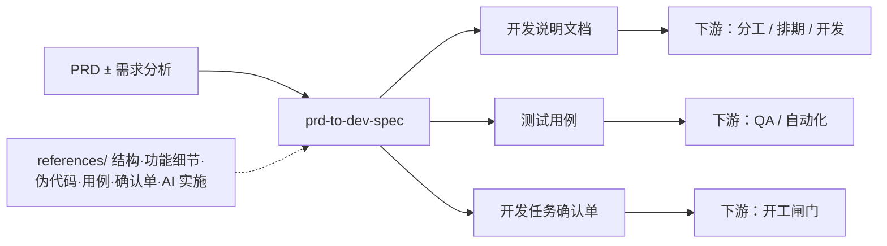

<div align="center">
  <h1>prd-to-dev-spec</h1>
  <p>
    <strong>已评审 / 已基线 PRD（+ 可选需求分析）→ 开发说明 + 测试用例 + 开发任务确认单</strong><br>
    面向 Agent 的开放 <strong>SKILL.md</strong>：把产品经理语义的 PRD「落地」为研发可执行的<strong>开发说明文档</strong>、从验收与逻辑推导的<strong>详细测试用例</strong>、以及跨角色签字前的<strong>开发任务确认单</strong>。强调 <strong>FR/AC 可追溯</strong>、模块与菜单/页面拆解、控件与按钮行为、业务/数据逻辑、接口与数据模型、关键路径<strong>伪代码</strong>与 <strong>Mermaid</strong> 图；对 AI 类需求扩展 <strong>Agent 工作流、职责分工、Prompt 包草案、实现与评测注意</strong>。输出以纯 Markdown 为主，便于在 Codex、Claude Code、Cursor 等环境复用。
  </p>
</div>

<p align="center">
  <a href="./README.en.md"></a>
  <a href="./README.md"></a>
</p>

<p align="center">
  <a href="./LICENSE"></a>
  
  
  
</p>

⬇️ [English](./README.en.md) · `skill` · `dev-spec` · `test-design` · `agent-agnostic`

---

<details open>
<summary><b>目录</b></summary>

- [它解决什么问题](#它解决什么问题)
- [Before / After](#before--after)
- [一句话怎么用](#一句话怎么用)
- [工作流程摘要](#工作流程摘要)
- [安装与前置条件](#安装与前置条件)
- [使用方式](#使用方式)
- [示例对话](#示例对话)
- [文件结构](#文件结构)
- [依赖](#依赖)
- [兼容 Agent](#兼容-agent)
- [安全与隐私：不要提交的内容](#安全与隐私不要提交的内容)
- [免责声明](#免责声明)
- [贡献与许可证](#贡献与许可证)

</details>

---

## 它解决什么问题

PRD 通过后，研发与测试仍需要<strong>可实现的模块/菜单/接口/数据设计</strong>、与 AC 对齐的<strong>可执行用例</strong>，以及在开工前把未决问题收口到<strong>确认单</strong>。若项目是 AI / Agent 型，还需要把 PRD 中的能力描述拆解为<strong>工作流、工具与数据边界、Prompt 形态与回退</strong>等工程视图，否则开发与联调会持续「猜需求」。

**prd-to-dev-spec** 在 `SKILL.md` 中约定三份<strong>相互配合的交付草稿</strong>的默认结构与命名、`FA→FR→AC→模块/API/TC/任务` 的可追溯链，以及在 PRD 未基线时的<strong>风险提示</strong>文案（推断来源：`SKILL.md` 开篇与 Operating Rules）。

---

## Before / After

| | 只有 PRD 段落 | 使用本技能 |
|---|----------------|------------|
| **颗粒度** | 功能含糊、难估点 | 菜单/控件级说明 + 业务/数据逻辑 |
| **验收** | AC 与实现脱节 | 用例显式回溯 AC 与开发说明 |
| **开工前** | 口头「没问题」 | 确认单列出未决项与 owner |
| **AI 项目** | 只有产品话术 | Agent 流程、Prompt 包草案、评测/回退注意 |
| **多 Agent** | 格式割裂 | Markdown、表格、Mermaid、代码块通用 |

---

## 一句话怎么用

```
以下是一份已评审（或草稿）PRD，可选附带需求分析（粘贴如下）。
请按 prd-to-dev-spec 的 SKILL.md 输出三份协调一致的 Markdown，文件名采用 SKILL 中的约定：
{project-name}-开发说明文档.md、{project-name}-测试用例.md、{project-name}-开发任务确认单.md。
若 PRD 未基线，请在文首与风险节标注「基于未基线 PRD 的草案」并列出须产品/架构确认的问题。
开放问题请用 OQ-{nn} 登记 Owner。若将由编码 Agent 实现，请在确认单中勾选，以便下游 engineering-delivery 产出 AI-Agent 任务卡。
```

---

## 工作流程摘要



---

## 安装与前置条件

| 条件 | 用途 | 是否必需 |
|------|------|----------|
| 支持 **SKILL.md** 的 Agent | 解析并执行本技能 | **是** |
| **PRD**（已基线更佳） | 范围与 AC 的来源 | **是** |
| 可选：<strong>需求分析文档</strong> | 补充问题背景与方案取舍 | 否 |

**推荐**：将本目录加入 Agent 的 skills 扫描路径。撰写时按需打开 `references/`（开发说明结构、功能细节规范、伪代码指南、用例设计、确认单模板、AI 实施说明）。

---

## 使用方式

### 1. 标准：三文档一次到位

粘贴 PRD 全文（与项目名/版本说明）。要求严格遵循 `SKILL.md` 的章节与追溯表；测试用例须从 AC 与开发逻辑推导，而非复述口语需求。

### 2. PRD 仍在评审：仍出草案但打标

要求输出中显式包含「基于未基线 PRD 的草案」、开放问题清单与建议 owner（与 `SKILL.md` 一致）。

### 3. AI / Agent 能力：展开第 13 类章节

当 PRD 含 Agent/工具/模型能力时，要求补齐 Agent 工作流、职责、Prompt 包草案、评测与回退，并引用 `references/ai-implementation.md`。

### 4. Agent 无法写文件时

按 `SKILL.md` 的 Agent Compatibility：在对话中分段给出「文件名 + Markdown 正文」。

---

## 示例对话

| 目标 | 示例提示 |
|------|----------|
| 三件套 | 「PRD 如下，请按 prd-to-dev-spec 产出开发说明、测试用例、确认单，项目名 xxx。」 |
| 强追溯 | 「每个功能小节末尾加 FR/AC/TC 对照表。」 |
| 控件级 | 「登录页每一个按钮单击/双击/禁用态的逻辑写清。」 |
| AI 特性 | 「含审批 Agent，请输出 Agent 时序图 + Prompt 包 + 评测样本字段。」 |
| 未基线 | 「PRD v0.9 未定稿，请出草案并在确认单列阻塞项。」 |

---

## 文件结构

| 路径 | 说明 |
|------|------|
| [SKILL.md](SKILL.md) | 主技能：摄入规则、开发说明章节、菜单/函数规格、AI 扩充、兼容说明 |
| [references/](references/) | 文档结构、功能细节、伪代码、用例设计、确认单、AI 实施注释 |
| [demo/](demo/README.md) | 固定 PRD 输入与三件套轻量金样、[TEST-RUN.md](demo/TEST-RUN.md) |
| [agents/openai.yaml](agents/openai.yaml) | OpenAI Agents / SDK 等宿主的能力声明示例（可按需适配） |
| [README.md](README.md) / [README.en.md](README.en.md) | 本说明（中/英） |
| [CONTRIBUTING.md](CONTRIBUTING.md) / [SECURITY.md](SECURITY.md) | 贡献指南与安全策略 |
| [LICENSE](LICENSE) | MIT |

---

## 依赖

| 依赖 | 用途 | 必需？ |
|------|------|--------|
| 支持 SKILL.md 的 Agent | 对话执行 | **是** |
| Markdown / Mermaid（可选） | 阅读排版 | 否 |

本仓库<strong>不包含</strong>特定项目管理或测试管理 SaaS；确认单与用例可再导入你方工具。

---

## 兼容 Agent

开放 `SKILL.md` 形式，**不绑定**单一产品。若无法挂载 `references/`，请要求 Agent 在回复中内联必要规则片段。

---

## 安全与隐私：不要提交的内容

| 类别 | 说明 |
|------|------|
| **密钥与令牌** | API Key、模型网关密钥、生产 JWT 等不得写入公开 PRD/开发说明正文。 |
| **个人数据样例** | 用例与数据模型举例应脱敏或用合成数据。**推断**：符合常见隐私工程实践。 |
| **内网拓扑** | 真实内网服务名、未公开 URL 可用占位符替代。 |

---

## 免责声明

本 Skill 产出为<strong>需求到研发交接的辅助文档</strong>，不能替代架构评审、安全评估、合同义务或合规结论；实施细节仍须由团队结合真实系统验证。

---

## 贡献与许可证

欢迎通过 Issue / PR 改进模板章节、示例提示或与新版 Agent 能力的兼容说明。细则见 [CONTRIBUTING.md](CONTRIBUTING.md)；安全见 [SECURITY.md](SECURITY.md)。

本仓库默认以根目录 [LICENSE](LICENSE) **MIT License** 为准。
