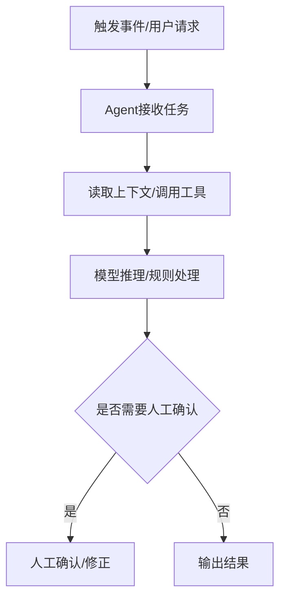

# PRD To Dev Spec

Turn a reviewed PRD into developer-facing execution documents. Produce **three coordinated drafts** by default:

1. **Development Specification**: technical modules, menus/functions, UI controls, button behavior, business logic, data logic, APIs, data model, diagrams, risks, and implementation notes.
2. **Test Case Document**: detailed test cases derived from PRD acceptance criteria and development logic.
3. **Development Task Confirmation Checklist**: pre-development confirmation sheet for product, engineering, QA, and stakeholders.

Use project-name file names:

```text
{project-name}-开发说明文档.md
{project-name}-测试用例.md
{project-name}-开发任务确认单.md
```

If the PRD is not baselined, still draft the documents when asked, but mark them as **基于未基线PRD的草案** and list risks.

## Operating Rules

1. Use the baselined PRD as the source of truth. Do not invent scope beyond PRD without marking it as assumption or open question.
2. Preserve traceability: `FA -> FR -> AC -> Module/Menu/API/Data/TC/Task`.
3. Split by executable delivery units: module, menu/page, function, API, data object, integration, job, AI capability, and test scope.
4. Every menu/function detail must include: menu/function name, entry, permissions, UI/control details, button behavior, business logic, data logic, validations, exceptions, and acceptance/test mapping.
5. Include low-fidelity prototype sketches when UI exists. Use Markdown tables, ASCII layout, or Mermaid user flow; do not over-design visual style.
6. Include diagrams when useful: architecture/module diagram, business flow, sequence diagram, state diagram, ER/data diagram.
7. Mermaid diagrams must use cross-platform compatible syntax. Use English/digit/underscore IDs, put Chinese in display labels or aliases, avoid high-risk edge-label syntax such as `-.label.->`, keep version numbers and punctuation-heavy text out of edge labels, and run a Mermaid compatibility self-check before delivery.
8. Add pseudocode for key functions when logic is complex, high-risk, stateful, algorithmic, permission-sensitive, data-sensitive, integration-heavy, or AI-related. Keep pseudocode language-neutral unless the user specifies a stack.
9. For AI applications, expand PRD AI/Agent sections into engineering detail: Agent workflow, Agent responsibilities, tool/data permissions, key sequence flow, orchestration pseudocode, AI Prompt Package, evaluation, fallback, and monitoring.
10. For AI applications, include an **AI Prompt Package** draft: system prompt, user prompt template, input variables, output schema, few-shot examples when useful, safety boundaries, fallback behavior, evaluation samples, and prompt versioning.
11. Keep pseudocode and prompt examples in Markdown/code blocks so they work across Codex, Claude Code, Cursor, and other agents; do not depend on proprietary tools unless the user explicitly asks.
12. For database changes, generate script specifications and SQL drafts by change type and by table: database creation, table creation, schema alteration, index/constraint changes, seed/reference data, data correction, data migration/backfill, rollback, and verification. Mark every script as **draft / not executed / requires DBA or data engineer review**.
13. Generate test cases from PRD AC and dev spec logic, not directly from vague product text.
14. End with a development task confirmation checklist. Development should not start until unresolved questions have owners or are closed.
15. Use the same ID conventions as upstream PRD: `FA-{nnn}`, `FR-{nnn}`, `AC-{nn}`, `OQ-{nn}`, `TC-{nnn}`. Do not rename AC IDs (e.g. do not change `AC-01` to `AC-001`).
16. In the task confirmation checklist, state whether work will be executed by **AI coding agents**. If yes, flag that `engineering-delivery` must produce AI Agent task cards and link implementation todolist items to `AIC-xxx`.

## Reference Loading

Load only what is needed:

| Need | Reference |
|------|-----------|
| Development spec structure | [references/dev-spec-structure.md](references/dev-spec-structure.md) |
| Mermaid rendering compatibility | [references/mermaid-compatibility.md](references/mermaid-compatibility.md) |
| Menu/function/UI/button detail | [references/function-detail-guide.md](references/function-detail-guide.md) |
| Key-function pseudocode | [references/pseudocode-guide.md](references/pseudocode-guide.md) |
| Database script specification | [references/database-script-spec.md](references/database-script-spec.md) |
| Test case derivation | [references/test-case-design.md](references/test-case-design.md) |
| Development confirmation checklist | [references/task-confirmation.md](references/task-confirmation.md) |
| AI implementation notes | [references/ai-implementation.md](references/ai-implementation.md) |

## Agent Compatibility

Keep this skill portable across Codex, Claude Code, Cursor, and other Markdown-capable agents:

- Use plain Markdown, tables, ASCII sketches, and Mermaid diagrams.
- Keep AI Prompt Packages in Markdown/code blocks, not in a vendor-specific prompt manager only.
- Do not require proprietary design/prototype tools unless the user explicitly asks for generated design assets.
- If an agent cannot load `references/`, inline the relevant reference rules into the response.
- If an agent cannot write files, output the intended file names and Markdown bodies in chat.

## Bilingual Usage

Match the user's requested output language. If the user writes in Chinese or does not specify a language, Chinese output is acceptable; if the user asks for English, produce English documents. Keep frontmatter metadata in English for cross-agent compatibility.

Common Chinese requests that should trigger this skill include:

- 开发说明文档
- 技术方案 / 技术模块拆解
- 开发任务清单 / 开发确认单
- 测试用例
- PRD转开发
- 菜单/功能说明
- 按钮细节 / 业务逻辑 / 数据逻辑
- 原型草图

## Workflow

### 1. Intake

Extract from PRD and optional requirement analysis:

| Item | Output |
|------|--------|
| Project name | Use PRD title or infer |
| PRD version/status | Draft / In Review / Baselined |
| Scope | V1/MVP, Out of Scope |
| Traceability | FA, FR, AC, business rules, NFRs |
| Product shape | Web/App/backend/integration/reporting/AI |
| AI/Agent design | Agent workflow, Agent responsibilities, AI/Agent function list, prompt design from PRD |
| Existing constraints | Tech stack, systems, data, permission, deadline |
| Database impact | New database/schema/table/data/index/migration/rollback/check requirements |

If PRD lacks traceability, reconstruct a lightweight mapping and mark it as inferred.

### 2. Build Development Specification

Required sections:

1. Source and baseline information
2. Scope and non-scope
3. Architecture and module overview
4. Menu/function list
5. Detailed function specification
6. Business logic
7. Data logic and data model
8. API/interface/integration design
9. Database change and script specification, when data storage changes
10. Permissions and audit
11. Exceptions and edge cases
12. Key-function pseudocode, when triggered
13. Non-functional implementation notes
14. Agent workflow and AI implementation notes, if any
15. Deployment, migration, configuration, and rollout notes
16. Requirement traceability
17. Risks and open questions

For AI-enhanced or AI-core work, section 13 must include Agent workflow/design and the AI Prompt Package unless the PRD explicitly says no prompt-based capability exists.

### 3. Detail Each Menu Or Function

For each menu/page/function, include:

| Field | Required Content |
|-------|------------------|
| Menu/function name | User-facing name and internal module name |
| Purpose | What user/business goal it supports |
| Entry | Navigation path, trigger, route, API entry, scheduled job |
| Roles/permissions | Who can see/use/edit/approve/export |
| UI/prototype sketch | Low-fidelity layout or state table when there is UI |
| Controls/buttons | Button names, states, enable/disable rules, confirmation dialogs |
| Business logic | Rules, calculations, state transitions, workflows |
| Data logic | Read/write fields, validation, default values, derived fields |
| Pseudocode | Required for key functions or complex/high-risk logic |
| API/events | Request/response, side effects, external dependencies |
| Exceptions | Empty, invalid, permission denied, duplicate, timeout, rollback |
| Logs/audit | What to log and what must not be logged |
| Related PRD items | FR/AC/BR/NFR |

### 4. Generate Test Cases

Create test cases from:

```text
FR + AC + business rules + data logic + permission + exception + NFR
```

Cover: main path, boundary, validation, permissions, state transitions, data consistency, integration failure, UI button behavior, AI low-confidence/fallback when applicable, and regression.

### 5. Generate Development Task Confirmation Checklist

The checklist is the final handoff gate before coding. It should include:

1. Document baseline confirmation
2. Scope confirmation
3. Module/function confirmation
4. API/data confirmation
5. UI/prototype confirmation
6. Test coverage confirmation
7. Risks/open questions/owners
8. Task list with owner, priority, dependency, estimate, acceptance link

## Development Specification Template

```markdown
# {项目名} 开发说明文档

> **文档状态**：草案
> **版本**：v0.1  **日期**：YYYY-MM-DD  **作者**：Agent+用户
> **依据PRD**：{项目名}-产品需求文档-PRD.md（版本/状态：...）
> **关联需求分析**：{项目名}-需求分析文档.md

## 1. 来源、范围与基线

## 2. 技术方案总览

### 2.1 架构/模块图

### 2.2 模块清单
| 模块 | 职责 | 关联菜单/功能 | 关联FR/AC | 备注 |
|------|------|--------------|-----------|------|

## 3. 菜单/功能清单
| 菜单/功能名 | 类型 | 入口 | 角色权限 | 关联模块 | 关联FR/AC |
|-------------|------|------|----------|----------|-----------|

## 4. 详细功能说明

### 4.x {菜单/功能名}

| 项 | 内容 |
|----|------|
| 功能目标 | ... |
| 入口/路由 | ... |
| 角色权限 | ... |
| 关联PRD | FR-... / AC-... |

#### 4.x.1 草图/原型

#### 4.x.2 页面元素与按钮
| 元素/按钮 | 类型 | 默认状态 | 启用/禁用条件 | 点击/变更行为 | 校验/提示 |
|-----------|------|----------|----------------|----------------|-----------|

#### 4.x.3 业务逻辑

#### 4.x.4 数据逻辑
| 字段/对象 | 来源 | 读/写 | 校验 | 默认值/派生 | 备注 |
|-----------|------|-------|------|-------------|------|

#### 4.x.5 异常与边界

#### 4.x.6 关键逻辑伪代码（按触发条件）

```text
function {function_name}(input):
  validate input
  check permission
  load required data
  apply business rules
  persist changes or return result
  handle exceptions and audit log
```

## 5. 接口/API/事件设计

## 6. 数据模型与数据流

## 7. 数据库变更与脚本规范（如适用）

> 以下 SQL / migration 脚本均为草案，尚未执行。需由 DBA / 数据工程师在目标环境审核、备份、评估影响后执行。AI Agent 不得直接执行目标数据库变更。

### 7.1 数据库影响范围
| 对象类型 | 对象名 | 变更类型 | 影响说明 | 关联FR/AC |
|----------|--------|----------|----------|-----------|
| Database/Table/Column/Index/Data | ... | create/alter/seed/update/migrate | ... | ... |

### 7.2 脚本清单（按类型/按表拆分）
| 脚本文件 | 类型 | 对象/表 | 用途 | 状态 | 审核人 |
|----------|------|---------|------|------|--------|
| 001_create_database_{database}.sql | database-create | {database} | 创建数据库/Schema | Draft, Not Executed | DBA/数据工程师 |
| 010_create_table_{table}.sql | table-create | {table} | 创建表 | Draft, Not Executed | DBA/数据工程师 |
| 020_alter_table_{table}.sql | table-alter | {table} | 字段/约束变更 | Draft, Not Executed | DBA/数据工程师 |
| 030_seed_data_{table}.sql | data-seed | {table} | 初始/字典数据 | Draft, Not Executed | DBA/数据工程师 |
| 040_update_data_{table}.sql | data-update | {table} | 数据修正 | Draft, Not Executed | DBA/数据工程师 |
| 050_migrate_data_{table}.sql | data-migration | {table} | 数据迁移/回填 | Draft, Not Executed | DBA/数据工程师 |
| 090_rollback_{table_or_change}.sql | rollback | {table/change} | 回滚/补偿 | Draft, Not Executed | DBA/数据工程师 |
| 100_verify_{table_or_change}.sql | verification | {table/change} | 校验 | Draft, Not Executed | DBA/数据工程师 |

### 7.3 执行顺序与依赖

### 7.4 回滚与校验策略

## 8. 权限、审计与日志

## 9. 关键功能伪代码汇总（按需）

| 功能 | 触发原因 | 伪代码位置 | 关联FR/AC |
|------|----------|------------|-----------|

## 10. 非功能与运维实现说明

## 11. Agent工作设计与AI能力实现说明（如适用）

### 11.1 Agent工作流与编排



### 11.2 Agent职责说明
| Agent/能力 | 职责 | 输入 | 处理 | 输出 | 工具/数据权限 | 失败兜底 |
|------------|------|------|------|------|---------------|----------|

### 11.3 关键时序流程
（多 Agent / 模型 / 工具 / 外部系统 / 人审协作时，用 Mermaid `sequenceDiagram`。）

### 11.4 AI/Agent功能点实现清单
| 功能点 | 类型 | 关联FR/AC | 触发 | 输入 | 处理 | 输出 | 质量指标 | 兜底 |
|--------|------|-----------|------|------|------|------|----------|------|

### 11.5 Agent编排伪代码（按需）

```text
function run_agent_workflow(input, actor):
  validate input and permissions
  collect context and tool data
  build prompt or model request
  call model/tool with timeout and retry policy
  validate structured output
  if confidence below threshold:
    route to human confirmation
  persist result, versions, and audit log
  return final response
```

### 11.6 AI能力卡

### 11.7 Prompt包草案

#### 11.7.1 System Prompt 示例

#### 11.7.2 User Prompt 模板

#### 11.7.3 输入变量

#### 11.7.4 输出结构 / JSON Schema

#### 11.7.5 Few-shot 示例（如适用）

#### 11.7.6 禁止事项与安全边界

#### 11.7.7 低置信度与失败兜底

#### 11.7.8 Prompt测试样例与验收指标

#### 11.7.9 Prompt版本与变更记录

## 12. 部署、配置、迁移与灰度

## 13. 需求追溯矩阵
| FA | FR | AC | 模块/功能 | API/数据 | 测试用例 |
|----|----|----|-----------|----------|----------|

## 14. 风险与未决问题
```

## Test Case Template

```markdown
# {项目名} 测试用例

> **依据PRD**：{项目名}-产品需求文档-PRD.md
> **依据开发说明**：{项目名}-开发说明文档.md

| TC | 关联FR/AC | 模块/功能 | 优先级 | 类型 | 前置条件 | 测试数据 | 步骤 | 预期结果 |
|----|-----------|-----------|--------|------|----------|----------|------|----------|
```

## Task Confirmation Template

```markdown
# {项目名} 开发任务确认单

> **确认状态**：待确认 | 已确认 | 有阻塞
> **依据PRD**：...
> **依据开发说明**：...
> **依据测试用例**：...

## 1. 开发前确认清单
| 检查项 | 状态 | 负责人 | 备注 |
|--------|------|--------|------|
| PRD 已基线 | 是/否 | 产品 | ... |
| 开发说明覆盖全部 FR/AC | 是/否 | 技术 | ... |
| 测试用例覆盖全部 AC | 是/否 | 测试 | ... |
| UI/原型已确认 | 是/否/不适用 | 产品/设计 | ... |
| 数据/API/权限已确认 | 是/否 | 技术 | ... |
| 数据库脚本草案已生成且标记未执行 | 是/否/不适用 | DBA/数据工程师 | ... |
| 未决问题已关闭或有负责人 | 是/否 | 项目负责人 | ... |
| 开放问题使用 OQ-{nn} 且含 Owner | 是/否 | 产品 | ... |
| 是否由 AI 编码 Agent 实现 | 是/否/部分 | 技术负责人 | 若是，须触发 engineering-delivery 四件套 |
| 下游须产出 AI-Agent 任务卡 | 是/否/不适用 | 技术负责人 | 与 todolist AIC 链接 |

## 2. 开发任务清单
| 任务ID | 任务 | 模块/功能 | 关联FR/AC | 优先级 | 依赖 | 负责人 | 预估 | 完成标准 |
|--------|------|-----------|-----------|--------|------|--------|------|----------|
```

## Self-Check

- [ ] Inputs are tied to a PRD version/status.
- [ ] No new scope is added silently beyond PRD.
- [ ] Every core function includes menu/function name, buttons/controls, business logic, data logic, exceptions, and traceability.
- [ ] Key functions include language-neutral pseudocode when logic is complex, high-risk, stateful, algorithmic, permission-sensitive, data-sensitive, integration-heavy, or AI-related.
- [ ] UI functions include a low-fidelity sketch or a reason why no UI sketch is needed.
- [ ] Architecture/flow/sequence/state/ER diagrams are included when useful.
- [ ] Every Mermaid block passes compatibility checks: closed code fence, valid diagram type, English IDs, Chinese only in labels/aliases, no high-risk edge labels such as `-.label.->`, and no punctuation-heavy labels on edges.
- [ ] Database changes include script specifications and SQL drafts by change type and by table, all marked draft/not executed/requires DBA or data engineer review.
- [ ] AI applications include a Prompt Package draft with system prompt, user prompt template, input variables, output schema, safety boundaries, fallback, evaluation samples, and versioning.
- [ ] AI applications include Agent workflow, Agent responsibility table, key sequence flow, function list, orchestration pseudocode when needed, permissions, fallback, and monitoring.
- [ ] Test cases trace to FR/AC and cover permissions, boundaries, exceptions, and data consistency.
- [ ] The task confirmation checklist clearly states blockers, owners, dependencies, and completion standards.
- [ ] AC IDs match upstream PRD (`AC-01` style); TC IDs trace to FR/AC in tables.
- [ ] Dev spec includes API paths, data fields, and pseudocode for key/high-risk functions (or states why omitted).
- [ ] Task confirmation states AI-coding handoff to `engineering-delivery` (quad + AIC) when applicable.
- [ ] Open questions use `OQ-{nn}` with owner/impact, aligned with PRD/analysis.
