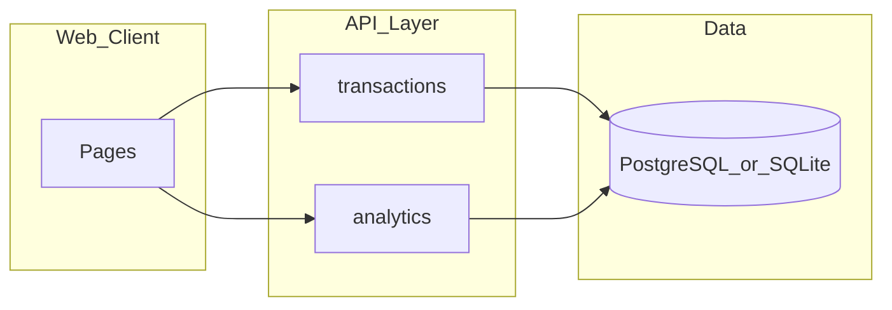

# DailyBill 开发说明文档

> **文档状态**：基于未基线 PRD 的草案（回归金样）  
> **PRD 版本**：v0.1  **日期**：2026-06-03  
> **追溯**：UC-DEMO-BILL-DEV-01 · [input-prd.md](input-prd.md) · [expected-traceability.md](../../requirements-to-prd/demo/expected-traceability.md)

## 1. 文档说明与范围

| 项 | 内容 |
|----|------|
| 项目 | DailyBill 个人日账 |
| 技术假设（回归） | Web MVP + REST API + 关系型库 `dailybill`；具体栈由团队选定 |
| 模块 | M-01 记账、M-02 分析 |
| Out of Scope | 投资建议、支付直连、多人账本、LLM 长文建议（V1） |

## 2. 技术方案总览



| 层级 | 职责 | 备注 |
|------|------|------|
| 前端 | 记一笔、流水列表、分析页 | OQ-01 默认 Web |
| API | 流水 CRUD、分类建议、周期汇总 | 见 §5 |
| 数据 | `transactions`、`categories`、`tags` | V1 单用户 `user_id` 占位 |

## 3. 模块与菜单

| 模块 | 菜单/页面 | 路由（示例） | 关联 FR |
|------|-----------|--------------|---------|
| M-01 | 记一笔 | `/add` | FR-001, FR-002, FR-006 |
| M-01 | 流水列表 | `/transactions` | FR-001 |
| M-02 | 分析视图 | `/analytics` | FR-004, FR-005 |

## 4. 功能详述：记一笔

| 项 | 说明 |
|----|------|
| 入口 | 首页「记一笔」→ `/add` |
| 权限 | V1 单用户；无登录时本地单租户 |
| 控件 | 类型（收入/支出）、金额（必填）、日期（默认今天）、备注；按钮：保存、取消 |
| 业务逻辑 | 保存前校验金额；保存后请求分类/标签建议并展示；用户可改类目/标签再提交 |
| 数据逻辑 | `POST /api/transactions` 写入 `transactions`；`category_id`、多对多 `transaction_tags` |
| 异常 | 缺金额/不可解析 → 400 + 字段错误（FR-006 / AC-03） |
| 日志 | 不记录备注明文到第三方；错误含 `request_id` |
| 追溯 | FR-001, FR-002 · AC-01, AC-03 |

### 4.1 UI 草图（低 fidelity）

```text
+----------------------------------+
| 记一笔                    [取消] |
| 类型 ( ) 支出  ( ) 收入          |
| 金额 [________] *                |
| 日期 [2026-06-03]                |
| 备注 [______________]            |
| 建议类目 [餐饮 v]  标签 [#咖啡]   |
|              [ 保存 ]            |
+----------------------------------+
```

### 4.2 关键逻辑伪代码（保存流水）

```text
function saveTransaction(input):
  if input.amount is missing or not parseable positive number:
    return validationError("amount_required")   // FR-006, AC-03
  txn = persist(type, amount, occurred_at, note)
  suggestion = classifyEngine.suggest(txn)      // FR-002, rules first
  return { transaction: txn, suggestion }
```

## 5. 功能详述：流水列表（摘要）

| 项 | 说明 |
|----|------|
| 入口 | `/transactions` |
| 控件 | 列表按日期倒序；点击进入编辑（FR-001） |
| API | `GET /api/transactions?from=&to=` |
| 追溯 | FR-001 · AC-01 |

## 6. 功能详述：分析视图（摘要）

| 项 | 说明 |
|----|------|
| 入口 | `/analytics` |
| 控件 | 周期选择器；汇总卡片；类目饼图/表；建议区（规则模板） |
| API | `GET /api/analytics/summary?period=` |
| 业务逻辑 | 仅统计已确认流水；至少一条规则建议文案（FR-005） |
| 追溯 | FR-004, FR-005 · AC-04 |

## 7. 接口与数据

### 7.1 API

| API | 方法 | 请求要点 | 响应要点 | FR |
|-----|------|----------|----------|-----|
| `/api/transactions` | POST | type, amount, occurred_at, note? | 201 + transaction body | FR-001 |
| `/api/transactions` | GET | from, to, page | 200 + items[] | FR-001 |
| `/api/transactions/{id}/suggest` | GET | — | suggested category_id, tag_ids[] | FR-002 |
| `/api/analytics/summary` | GET | period | totals, by_category[], suggestions[] | FR-004, FR-005 |

### 7.2 数据模型（核心）

| 表 | 关键字段 | 说明 |
|----|----------|------|
| transactions | id, type, amount, occurred_at, note, category_id, status | status: confirmed（V1 默认） |
| categories | id, name, parent_id | 用户可维护 FR-008 |
| tags | id, name | |
| transaction_tags | transaction_id, tag_id | |

### 7.3 数据库变更

本回归用例 **无 DDL**；正式项目变更须按 `database-script-spec` 出草案，标记 DRAFT / NOT EXECUTED。

## 8. AI / Agent 实施（V1）

| 项 | 说明 |
|----|------|
| 产品形态 | 传统 + **规则型 AI 增强**（分类/建议），无 V1 Prompt 包 |
| Agent 工作流 | N/A（无多 Agent 编排） |
| 后续 V1.1 | 可增 LLM 分类；届时补 Prompt 包 + JSON Schema |

## 9. 追溯矩阵

| FR | 模块 | API/表 | TC |
|----|------|--------|-----|
| FR-001 | M-01 | POST/GET transactions | TC-001 |
| FR-002 | M-01 | GET suggest | TC-002 |
| FR-006 | M-01 | 校验层 | TC-003 |
| FR-004 | M-02 | analytics/summary | TC-004 |
| FR-005 | M-02 | suggestions[] | TC-005 |

## 10. 风险与开放问题

| ID | 问题 | Owner | 对开发说明影响 |
|----|------|-------|----------------|
| OQ-01 | 端形态 | 产品 | 默认 Web；原生 App 另立项 |
| OQ-02 | 分类记忆 | 产品 | FR-003 可标 Optional |

## 11. 下游交付（engineering-delivery）

| 检查项 | 建议 |
|--------|------|
| 是否 AI 编码 | 是 → 须产出 `DailyBill-AI-Agent任务卡.md` + todolist 链 AIC |
| 输入本说明 | 版本 v0.1 + [expected-test-cases.md](expected-test-cases.md) |
