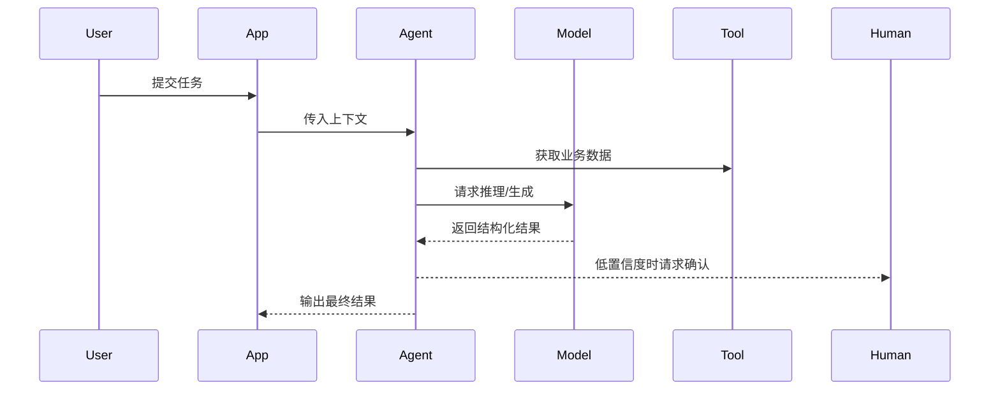

# AI Implementation Notes

Use this reference when the PRD contains AI-enhanced or AI-core capabilities.

## Agent Workflow Engineering

When the PRD includes Agent work design, convert it into engineering detail:

````markdown
### Agent工作流与编排

| 步骤 | 触发/输入 | Agent/模块 | 工具/数据 | 处理逻辑 | 输出 | 失败兜底 |
|------|-----------|------------|-----------|----------|------|----------|

### Agent职责说明
| Agent/能力 | 职责 | 输入 | 输出 | 工具/数据权限 | Prompt/模型 | 质量指标 | 兜底 |
|------------|------|------|------|---------------|-------------|----------|------|

### 关键时序流程

````

Engineering detail must include permissions, timeout, retry, fallback, audit log, prompt/model version, and human correction loop.

## AI Implementation Card

```markdown
### AI能力：{能力名}

| 项 | 内容 |
|----|------|
| 关联PRD | FR/AC |
| 输入 | 用户输入、业务数据、上下文 |
| 处理 | Prompt/规则/模型/API/检索/分类 |
| 输出 | JSON/schema/text/score/action |
| 置信度 | 阈值、展示、低置信处理 |
| 人工兜底 | 谁确认、谁修正、如何回写 |
| 日志 | 输入输出摘要、敏感字段脱敏、错误 |
| 评估 | 样本集、指标、通过门槛 |
| 监控 | 采纳率、修改率、失败率、成本、延迟 |
| Prompt包 | System Prompt、User Prompt模板、输出Schema、样例、版本 |
```

## AI Technical Requirements

- Define input and output schema.
- Prefer structured output for downstream processing.
- Define timeout, retry, and fallback.
- Define what data cannot be sent to model/API.
- Define human correction and feedback loop.
- Define quality metrics before development.
- Provide a Prompt Package draft for prompt-based AI capabilities.

## AI Prompt Package

For AI-enhanced or AI-core capabilities that use prompts, include this package in the development specification:

````markdown
### Prompt包：{能力名}

> **状态**：草案，需产品/技术/测试评审
> **版本**：prompt-v0.1
> **关联PRD**：FR-... / AC-...

#### 1. Prompt目标
说明模型要完成的任务、边界和成功标准。

#### 2. System Prompt 示例
```text
你是{角色}。你的任务是{任务}。
必须遵守：
1. ...
2. ...
输出必须符合指定 JSON Schema。
如果信息不足，返回 need_more_info，不要编造。
```

#### 3. User Prompt 模板
```text
请基于以下输入完成任务：
- 用户目标：{{user_goal}}
- 业务上下文：{{business_context}}
- 输入数据：{{input_data}}
- 约束条件：{{constraints}}
```

#### 4. 输入变量
| 变量 | 来源 | 类型 | 是否必填 | 脱敏/过滤规则 |
|------|------|------|----------|----------------|

#### 5. 输出结构 / JSON Schema
```json
{
  "result": "string",
  "confidence": 0.0,
  "reason": "string",
  "need_more_info": false,
  "warnings": []
}
```

#### 6. Few-shot 示例（如适用）
| 输入 | 期望输出 | 说明 |
|------|----------|------|

#### 7. 禁止事项与安全边界
- 不得输出...
- 不得使用...
- 信息不足时...

#### 8. 低置信度与失败兜底
| 场景 | 系统行为 | 人工兜底 |
|------|----------|----------|

#### 9. Prompt测试样例与验收指标
| 样例ID | 输入 | 期望 | 指标 |
|--------|------|------|------|

#### 10. 版本与变更记录
| 版本 | 变更 | 原因 | 日期 |
|------|------|------|------|
````

Keep prompt packages in Markdown/code blocks for portability across Codex, Claude Code, Cursor, and similar agents. If the implementation uses a vendor-specific prompt management system, include that as an optional deployment detail, not as the only source of truth.

## AI Test Cases

Cover:

| Case | Example |
|------|---------|
| Normal | AI returns valid structured result |
| Low confidence | System asks for user confirmation |
| Invalid output | System rejects or repairs output |
| Timeout/failure | System falls back to rules/manual |
| Sensitive data | Logs/prompts mask prohibited fields |
| User correction | Correction persists and is auditable |

## Anti-Pattern

Do not write only "call AI to generate result". Specify input, process, output, validation, fallback, and evaluation.
