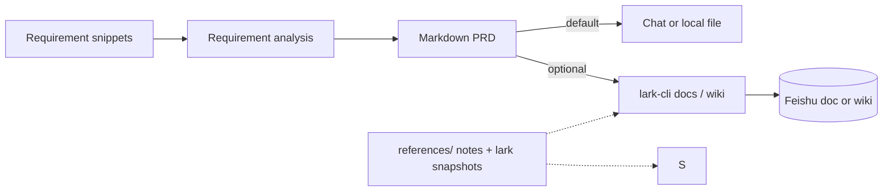

<div align="center">
  <h1>requirements-to-prd</h1>
  <p>
    <strong>Fragmented input → requirement analysis + PRD</strong><br>
    An open <strong>SKILL.md</strong> for agents: turn rough notes into a <strong>requirement analysis document</strong> and a shippable <strong>Markdown PRD</strong> with functional atomization, feasibility-aware solution discovery, AI/traditional solution fit, EARS / GWT, scope, and checklists. The skill <strong>supports Feishu</strong>: with your app and permissions set up, use <strong>lark-cli</strong> to publish final documents to <strong>Docs or Wiki</strong>. Feishu steps, placeholders, and scopes are in <a href="./SKILL.md">SKILL.md</a> and <a href="./references/README.en.md">references/</a>.
  </p>
</div>

<p align="center">
  <a href="./README.en.md"></a>
  <a href="./README.md"></a>
</p>

<p align="center">
  <a href="./LICENSE"></a>
  
  <a href="https://github.com/larksuite/cli"></a>
  
  
  <a href="https://github.com/Lucky2024-pllove/req-to-prd-to-dev-eng-all-skills"></a>
</p>

⬇️ [中文](./README.md) · `skill` · `prd` · `lark-cli` · `agent-agnostic`

---

<details open>
<summary><b>Table of contents</b></summary>

- [What it solves](#what-it-solves)
- [Before / After](#before--after)
- [One-liner prompt](#one-liner-prompt)
- [Flow (summary)](#flow-summary)
- [Prerequisites & install](#prerequisites--install)
- [How to use](#how-to-use)
- [Example prompts](#example-prompts)
- [Repository layout](#repository-layout)
- [Dependencies](#dependencies)
- [Agent compatibility](#agent-compatibility)
- [Security & privacy: do not commit](#security--privacy-do-not-commit)
- [Disclaimer](#disclaimer)
- [Contributing & license](#contributing--license)

</details>

---

## What it solves

Early-stage product work often starts with **fragments**. Teams need a **requirement analysis document** to decide the real problem, feasible solution, and functional atoms, then a **complete, testable PRD** for design, engineering, QA, and stakeholders. If you want the final documents **in Feishu** (**Docs** or **Wiki**), you also want **less copy-paste** and a **traceable handoff**.

**requirements-to-prd** encodes dual-document output, project-name file naming, functional atomization, EARS / GWT, scope, and checklists in `SKILL.md`. For Feishu, runs go through **`lark-cli`** with notes under `references/`. **If Feishu is not set up, the default deliverable is Markdown only.**

---

## Before / After

| | Bullet lists in chat only | With this skill |
|---|---------------------------|-----------------|
| **Structure** | Loose text, weak acceptance alignment | Requirement analysis + PRD with priority, Out of Scope, metrics |
| **Requirements** | Vague adjectives | EARS, Given-When-Then, NFR/data/permission hooks |
| **Feishu** | Manual paste | Optional: `lark-cli` to docs/wiki (**must** actually run CLI) |
| **Offline CLI help** | Constant web search | `references/` holds methodology + lark snapshots |

---

## One-liner prompt

```
I have a product requirement below. Use requirements-to-prd to output a requirement analysis document
and a PRD in Markdown in this chat only—do not assume Feishu write access.
```

If `lark-cli` is installed and you want Feishu export, add: “After I confirm, follow references/lark-cli.md, run lark-cli to create/update the doc or wiki node, and return the link or the full error.”

---

## Flow (summary)



---

## Prerequisites & install

| Prerequisite | Role | Required? |
|--------------|------|-----------|
| Agent with **SKILL.md** support (Cursor, Claude Code, …) | Run the skill | **Yes** |
| **Node.js** + `@larksuite/cli` (`lark-cli`) | Write to Feishu | Only if **exporting to Feishu** |
| Feishu app + user/app auth, scopes | Open APIs | Only if **exporting to Feishu** |

**Recommended**: add this folder to your agent skills path, or `git clone` beside your project. Before first Feishu write: `lark-cli config init`, `lark-cli auth login`—details in [references/lark-shared-SKILL.md](references/lark-shared-SKILL.md) and [references/lark-cli.md](references/lark-cli.md).

---

## How to use

### 1. Markdown in chat / local files only (no Feishu)

Ask for **full Markdown** or paths to save locally; **do not** invoke `lark-cli`. Open the relevant files under [references/](references/README.en.md) as needed.

### 2. After the PRD is stable, publish to Feishu

1. Confirm login and scopes (`lark-shared`).  
2. For wiki: supply or parse **parent node** / **space_id** (placeholders: [references/wiki-archive-defaults.en.md](references/wiki-archive-defaults.en.md)).  
3. Use `docs +create`, `wiki +node-create`, etc. per **your installed CLI**; the agent must rely on real terminal output, not invented `doc_url` values.

---

## Example prompts

| Goal | Example |
|------|---------|
| Dual docs | “Requirement: … output a requirement analysis document and a PRD; include the project name in both file names.” |
| PRD only | “Requirement: … PRD only; section 5 EARS with IDs; section 10 GWT; section 11 MVP/Out of Scope.” |
| PRD + diagrams | “If diagram-guide says to draw, add Mermaid flow + data/relationship sketch.” |
| Feishu | “After sign-off, use lark-cli under my parent wiki node to create the doc from this Markdown; paste errors verbatim on failure.” |

---

## Repository layout

| Path | Role |
|------|------|
| [SKILL.md](SKILL.md) | Main skill: when to use, dual-document workflow, file naming, templates, checklist |
| [references/](references/README.en.md) | Decomposition, feasibility, AI PRD, acceptance/testing, methodology, `lark-cli` map |
| [demo/](demo/README.md) | Fixed input and regression gold files for analysis + PRD |
| [README.md](README.md) / [README.en.md](README.en.md) | This doc (zh/en) |
| [CONTRIBUTING.md](CONTRIBUTING.md) / [SECURITY.md](SECURITY.md) | Contribution guide and security policy |
| [LICENSE](LICENSE) | MIT (original work in this repo; see below + upstream snapshots in `references/`) |

---

## Dependencies

| Dependency | Role | Required? |
|------------|------|-----------|
| SKILL.md-capable agent | Conversational execution | **Yes** |
| [@larksuite/cli](https://github.com/larksuite/cli) | Feishu writes | Only for Feishu export |
| Feishu Open Platform app + grants | APIs / user context | Only for Feishu export |

This repo **does not** vendor `lark-cli` source; it only documents CLI behavior.

---

## Agent compatibility

The skill is a plain `SKILL.md` pack **not tied** to one vendor. Typical use: place the folder in a project or global skills directory per your client’s docs (Cursor, Claude Code, etc.).

---

## Security & privacy: do **not** commit

Do **not** store credentials that enable app impersonation or account takeover. **Public** branches should also avoid real tenant resource IDs.

| Category | Notes |
|----------|--------|
| **App secrets** | Feishu **App Secret**, OAuth **client_secret**, etc.—secret store only. |
| **Private keys** | RSA/EC keys, `.pem`, JWT signing secrets. |
| **Tokens** | Full **user_access_token**, **tenant_access_token**, **refresh_token**, etc.—redact examples. |
| **Resource IDs** | Real **`space_id`**, **`parent_node_token`**, **`file_token`**—use placeholders in public repos (`wiki-archive-defaults*.md`). |

Treat `auth login` output per [references/lark-shared-SKILL.md](references/lark-shared-SKILL.md): **never** print secrets/tokens in plain text to untrusted sinks.

---

## Disclaimer

Outputs are **planning and alignment aids**, not legal sign-off, compliance guarantees, or executive approval—your team still owns the decision.

---

## Contributing & license

Issues and PRs are welcome for documentation updates and example commands aligned with the current `lark-cli` behavior. See [CONTRIBUTING.md](CONTRIBUTING.md) and [SECURITY.md](SECURITY.md).

- **Original work in this repo** (`SKILL.md`, `demo`, non-upstream `references` notes): licensed under the root [LICENSE](LICENSE) (**MIT**).  
- **Files copied into `references/`** from upstream (e.g. `lark-cli-README.zh.md`, some `lark-*-SKILL.md`): follow **their** licenses and attribution; the root MIT license does not supersede upstream terms—see [references/README.en.md](references/README.en.md).
