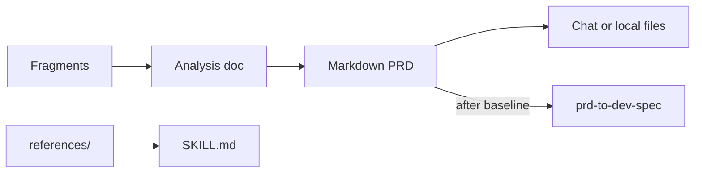

<div align="center">
  <h1>requirements-to-prd</h1>
  <p>
    <strong>Fragments → requirement analysis + PRD</strong><br>
    An open <strong>SKILL.md</strong> for agents: turn rough notes into a <strong>requirement analysis document</strong> and a shippable <strong>Markdown PRD</strong> with functional atomization, feasibility-aware solution discovery, AI/traditional solution fit, EARS / GWT, scope, and checklists. Details in <a href="./SKILL.md">SKILL.md</a> and <a href="./references/README.en.md">references/</a>.
  </p>
</div>

<p align="center">
  <a href="./README.en.md"></a>
  <a href="./README.md"></a>
</p>

<p align="center">
  <a href="./LICENSE"></a>
  
  
  
  <a href="https://github.com/Lucky2024-pllove/req-to-prd-to-dev-eng-all-skills"></a>
</p>

⬇️ [中文](./README.md) · `skill` · `prd` · `agent-agnostic`

---

<details open>
<summary><b>Contents</b></summary>

- [What it solves](#what-it-solves)
- [Before / After](#before--after)
- [Quick prompt](#quick-prompt)
- [Workflow](#workflow)
- [Install](#install)
- [Usage](#usage)
- [Sample prompts](#sample-prompts)
- [Layout](#layout)
- [Dependencies](#dependencies)
- [Agent compatibility](#agent-compatibility)
- [Security](#security)
- [Disclaimer](#disclaimer)
- [Contributing & license](#contributing--license)

</details>

---

## What it solves

Early-stage product work often starts with **fragments**. Teams need a **requirement analysis document** to decide the real problem, feasible solution, and functional atoms, then a **complete, testable PRD** for design, engineering, QA, and stakeholders—and as input to downstream `prd-to-dev-spec`.

**requirements-to-prd** encodes dual-document output, project-name file naming, functional atomization, EARS / GWT, scope, and checklists in `SKILL.md`. Default deliverable: **Markdown** (in chat or local files).

---

## Before / After

| | Chat-only bullet lists | With this skill |
|---|------------------------|-----------------|
| **Structure** | Scattered, hard to accept | Analysis + PRD with MVP, Out of Scope, metrics |
| **Requirements** | Vague adjectives | EARS, GWT, testable NFR/data/permissions |
| **Methodology** | Re-explained every session | Progressive `references/` load |
| **Handoff** | Unstable PRD shape | Baselined PRD → `prd-to-dev-spec` in the monorepo |

---

## Quick prompt

```
I have product requirements (below). Follow requirements-to-prd SKILL.md for analysis + PRD Markdown;
use the project name in file names; output in chat first.
```

---

## Workflow



---

## Install

| Requirement | Purpose | Required? |
|-------------|---------|-----------|
| SKILL.md-capable agent | Run this skill | **Yes** |

Add this folder to your agent skills path, or clone the monorepo and mount only `requirements-to-prd/`.

---

## Usage

Ask for full **Markdown** or paths under your project. Open [references/methodology.md](references/methodology.md), [references/diagram-guide.md](references/diagram-guide.md) as needed.

After human review marks the PRD **baselined**, hand off to [prd-to-dev-spec](../prd-to-dev-spec/) in the same monorepo.

---

## Sample prompts

| Goal | Example |
|------|---------|
| Both docs | “…output analysis + PRD; filenames include project name.” |
| PRD only | “…PRD only; §5 EARS, §10 GWT, §11 MVP/Out of Scope.” |
| Diagrams | “Add Mermaid per diagram-guide when signals match.” |
| Next stage | “PRD baselined—use prd-to-dev-spec for dev spec, tests, confirmation.” |

---

## Layout

| Path | Role |
|------|------|
| [SKILL.md](SKILL.md) | Main skill: workflow, templates, self-check |
| [references/](references/README.en.md) | Decomposition, feasibility, AI PRD, acceptance, methodology |
| [demo/](demo/README.md) | Regression gold files |
| [CONTRIBUTING.md](CONTRIBUTING.md) / [SECURITY.md](SECURITY.md) | Contribution and security |

---

## Dependencies

| Dependency | Required? |
|------------|-----------|
| SKILL.md-capable agent | **Yes** |
| Markdown / Mermaid viewer | No |

---

## Agent compatibility

Open `SKILL.md` format; not tied to a single IDE. Mount this folder per your agent’s skills documentation.

---

## Security

Do not commit real secrets, customer PII, or live credentials to public branches. See [SECURITY.md](SECURITY.md).

---

## Disclaimer

Outputs are **planning aids**, not substitutes for business, legal, or architecture sign-off.

---

## Contributing & license

Issues and PRs welcome. See [CONTRIBUTING.md](CONTRIBUTING.md). Original work in this folder is [MIT](LICENSE).
