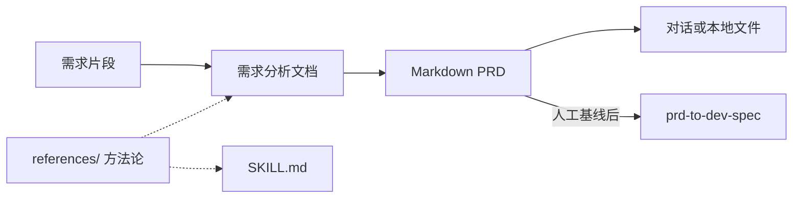

<div align="center">
  <h1>requirements-to-prd</h1>
  <p>
    <strong>用户需求 → 需求分析文档 + PRD</strong><br>
    面向 Agent 的开放 <strong>SKILL.md</strong>：把用户需求，先拆成 <strong>需求分析文档</strong>，再整理成可交付的 <strong>Markdown PRD</strong>（含功能原子化、方案可行性、AI/传统方案适配、EARS / GWT、范围与自检）。细则与方法论见 <a href="./SKILL.md">SKILL.md</a> 与 <a href="./references/README.md">references/</a>。
  </p>
</div>

<p align="center">
  <a href="./README.en.md"></a>
  <a href="./README.md"></a>
</p>

<p align="center">
  <a href="./LICENSE"></a>
  
  
  
  <a href="https://github.com/Lucky2024-pllove/req-to-prd-to-dev-eng-all-skills"></a>
</p>

⬇️ [English](./README.en.md) · `skill` · `prd` · `agent-agnostic`

---

<details open>
<summary><b>目录</b></summary>

- [它解决什么问题](#它解决什么问题)
- [Before / After](#before--after)
- [一句话怎么用](#一句话怎么用)
- [工作流程摘要](#工作流程摘要)
- [安装与前置条件](#安装与前置条件)
- [使用方式](#使用方式)
- [示例对话](#示例对话)
- [文件结构](#文件结构)
- [依赖](#依赖)
- [兼容 Agent](#兼容-agent)
- [安全与隐私](#安全与隐私)
- [免责声明](#免责声明)
- [贡献与许可证](#贡献与许可证)

</details>

---

## 它解决什么问题

产品/项目早期收到**用户需求**时，团队既需要一份能判断「真正问题、可行方案、功能拆解」的**需求分析文档**，也需要一份**结构完整、可测试、可排期**的 PRD，便于设计、研发、测试、业务对齐，并作为下游 `prd-to-dev-spec` 的输入。

**requirements-to-prd** 在 `SKILL.md` 里约定双文档输出、项目名文件命名、功能原子化、EARS / GWT、范围与自检清单；默认交付 **Markdown**（对话全文或本地文件）。

---

## Before / After

| | 仅聊天罗列功能点 | 使用本技能 |
|---|------------------|------------|
| **结构** | 段落零散、难对齐验收 | 需求分析 + PRD 双文档（含优先级、Out of Scope、指标） |
| **需求表述** | 形容词多、难测试 | EARS、Given-When-Then、NFR/数据/权限更易测 |
| **方法论** | 每次重讲拆解规则 | `references/` 可渐进加载，主 Skill 保持精简 |
| **下游交接** | PRD 口径不稳 | 定稿后可对接 monorepo 内 `prd-to-dev-spec` |

---

## 一句话怎么用

```
我有一段产品需求（如下），请按 requirements-to-prd 的 SKILL.md 输出需求分析文档和 PRD 两份 Markdown；
文件名带项目名，先只在对话里成文。
```

---

## 工作流程摘要



---

## 安装与前置条件

| 条件 | 用途 | 是否必需 |
|------|------|----------|
| 支持 **SKILL.md** 的 Agent（Cursor、Claude Code 等） | 解析并执行本技能 | **是** |

**推荐**：将本目录加入 Agent 的 skills 扫描路径，或 `git clone` monorepo 后只挂载 `requirements-to-prd/`。

---

## 使用方式

说明需要 **Markdown 全文** 或写入**你指定的本地路径**即可。撰写时按需打开 [references/methodology.md](references/methodology.md)、[references/diagram-guide.md](references/diagram-guide.md) 等。

PRD 经人工评审并标注**已基线**后，可交给同仓库 [prd-to-dev-spec](../prd-to-dev-spec/) 产出开发说明与测试用例。

---

## 示例对话

| 目标 | 示例提示 |
|------|----------|
| 双文档 | 「需求：……请输出需求分析文档和 PRD，两份文件名都带项目名。」 |
| 仅 PRD | 「需求：……只输出 PRD，第 5 节用 EARS 编号，第 10 节含 GWT，第 11 节含 MVP/Out of Scope。」 |
| PRD + 配图信号 | 「若命中 diagram-guide 的配图条件，请补 Mermaid 流程图与数据关系说明。」 |
| 流水线下一步 | 「PRD 已基线，请按 prd-to-dev-spec 产出开发说明、测试用例、确认单。」 |

---

## 文件结构

| 路径 | 说明 |
|------|------|
| [SKILL.md](SKILL.md) | 主技能：何时调用、双文档流程、文件命名、模板、自检清单 |
| [references/](references/README.md) | 需求拆解、方案可行性、AI PRD、验收测试边界、方法论、配图 |
| [demo/](demo/README.md) | 固定输入与回归金样：需求分析文档、PRD、[TEST-RUN.md](demo/TEST-RUN.md) |
| [README.md](README.md) / [README.en.md](README.en.md) | 本说明（中/英） |
| [CONTRIBUTING.md](CONTRIBUTING.md) / [SECURITY.md](SECURITY.md) | 贡献指南与安全策略 |
| [LICENSE](LICENSE) | MIT |

---

## 依赖

| 依赖 | 用途 | 必需？ |
|------|------|--------|
| 支持 SKILL.md 的 Agent | 对话执行本技能 | **是** |
| Markdown / Mermaid（可选） | 阅读与渲染长篇交付物 | 否 |

---

## 兼容 Agent

本技能为开放 `SKILL.md` 形式，**不绑定**单一产品。常见用法：将本文件夹置于项目目录或全局 skills 目录（具体路径以 Cursor、Claude Code 等官方文档为准）。

---

## 安全与隐私

本仓库**不应**在公开分支提交真实业务机密、客户数据或未脱敏的凭证。本地覆盖（`*.local.md`、`.env*`）见 [.gitignore](.gitignore)。细则见 [SECURITY.md](SECURITY.md)。

---

## 免责声明

本 Skill 产出为**产品规划与需求对齐辅助材料**，不能替代业务决策、法务合规或项目批复；关键结论仍须由团队评审确认。

---

## 贡献与许可证

欢迎通过 Issue / PR 提交文档修订。细则见 [CONTRIBUTING.md](CONTRIBUTING.md)；安全见 [SECURITY.md](SECURITY.md)。

对本仓库 **原创部分**（`SKILL.md`、`demo`、自撰 `references` 等）以 [LICENSE](LICENSE) **MIT License** 为准。
