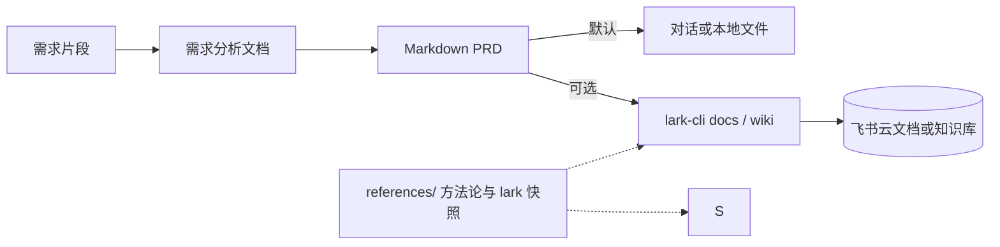

<div align="center">
  <h1>requirements-to-prd</h1>
  <p>
    <strong>零散需求 → 需求分析文档 + PRD</strong><br>
    面向 Agent 的开放 <strong>SKILL.md</strong>：把口头或草稿式需求，先拆成 <strong>需求分析文档</strong>，再整理成可交付的 <strong>Markdown PRD</strong>（含功能原子化、方案可行性、AI/传统方案适配、EARS / GWT、范围与自检）。本技能<strong>支持飞书</strong>：在配置好应用与权限后，可用 <strong>lark-cli</strong> 将定稿写入<strong>云文档或知识库</strong>。飞书侧步骤、占位符与权限见 <a href="./SKILL.md">SKILL.md</a> 与 <a href="./references/README.md">references/</a>。
  </p>
</div>

<p align="center">
  <a href="./README.en.md"></a>
  <a href="./README.md"></a>
</p>

<p align="center">
  <a href="./LICENSE"></a>
  
  <a href="https://github.com/larksuite/cli"></a>
  
  
  <a href="https://github.com/Lucky2024-pllove/req-to-prd-to-dev-eng-all-skills"></a>
</p>

⬇️ [English](./README.en.md) · `skill` · `prd` · `lark-cli` · `agent-agnostic`

---

<details open>
<summary><b>目录</b></summary>

- [它解决什么问题](#它解决什么问题)
- [Before / After](#before--after)
- [一句话怎么用](#一句话怎么用)
- [工作流程摘要](#工作流程摘要)
- [安装与前置条件](#安装与前置条件)
- [使用方式](#使用方式)
- [示例对话](#示例对话)
- [文件结构](#文件结构)
- [依赖](#依赖)
- [兼容 Agent](#兼容-agent)
- [安全与隐私：不要提交的内容](#安全与隐私不要提交的内容)
- [免责声明](#免责声明)
- [贡献与许可证](#贡献与许可证)

</details>

---

## 它解决什么问题

产品/项目早期只有**碎片化描述**时，团队既需要一份能判断「真正问题、可行方案、功能拆解」的**需求分析文档**，也需要一份**结构完整、可测试、可排期**的 PRD，便于设计、研发、测试、业务对齐。若要把定稿**同步到飞书**（**云文档**或**知识库**），还希望**少复制粘贴、版本可追踪**。

**requirements-to-prd** 在 `SKILL.md` 里约定双文档输出、项目名文件命名、功能原子化、EARS / GWT、范围与自检清单；需要落地飞书时，通过 **`lark-cli`** 执行写入，命令与权限可查阅 `references/` 内 lark 技能快照。**未配置飞书时，默认只交付 Markdown。**

---

## Before / After

| | 仅聊天罗列功能点 | 使用本技能 |
|---|------------------|------------|
| **结构** | 段落零散、难对齐验收 | 需求分析 + PRD 双文档（含优先级、Out of Scope、指标） |
| **需求表述** | 形容词多、难测试 | EARS、Given-When-Then、NFR/数据/权限更易测 |
| **飞书归档** | 手动粘贴、易丢格式 | 可选：`lark-cli` 写 docs / wiki 节点（须真实执行 CLI） |
| **离线查 CLI** | 依赖外网搜命令 | `references/` 含方法论与 lark 快照，便于本地打开 |

---

## 一句话怎么用

```
我有一段产品需求（如下），请按 requirements-to-prd 的 SKILL.md 输出需求分析文档和 PRD 两份 Markdown；
先只在对话里成文，不要假设已写入飞书。
```

若已安装 `lark-cli` 并要完成飞书写入，在需求末尾补充：「确认后请按 references/lark-cli.md 用 lark-cli 创建/更新文档或知识库节点，并返回链接或错误信息。」

---

## 工作流程摘要



---

## 安装与前置条件

| 条件 | 用途 | 是否必需 |
|------|------|----------|
| 支持 **SKILL.md** 的 Agent（Cursor、Claude Code 等） | 解析并执行本技能 | **是** |
| **Node.js** + `@larksuite/cli`（`lark-cli`） | 写入飞书 | 仅**需要落地飞书**时 |
| 飞书应用与用户/应用授权、scope | 调用开放 API | 仅**需要落地飞书**时 |

**推荐**：将本目录加入 Agent 的 skills 扫描路径，或 `git clone` 到项目旁使用。首次写入飞书前请 `lark-cli config init`、`lark-cli auth login`，细则见 [references/lark-shared-SKILL.md](references/lark-shared-SKILL.md) 与 [references/lark-cli.md](references/lark-cli.md)。

---

## 使用方式

### 1. 仅在对话 / 本地输出 PRD（不写飞书）

说明只要 **Markdown 全文** 或写入**你指定的本地路径**即可；**不执行** `lark-cli`。撰写时按需打开 [references/methodology.md](references/methodology.md)、[references/diagram-guide.md](references/diagram-guide.md)。

### 2. 成文后再同步飞书

1. 确认已登录且 scope 足够（见 `lark-shared`）。  
2. 知识库场景：由你提供或可解析的 **wiki 父节点** / **space_id**（占位符约定见 [references/wiki-archive-defaults.md](references/wiki-archive-defaults.md)）。  
3. 使用 `docs +create` / `wiki +node-create` 等命令以**当前 CLI 文档为准**；Agent 应使用终端真实输出，而非编造 `doc_url`。

---

## 示例对话

| 目标 | 示例提示 |
|------|----------|
| 双文档 | 「需求：……请输出需求分析文档和 PRD，两份文件名都带项目名。」 |
| 仅 PRD | 「需求：……只输出 PRD，第 5 节用 EARS 编号，第 10 节含 GWT，第 11 节含 MVP/Out of Scope。」 |
| PRD + 配图信号 | 「若命中 diagram-guide 的配图条件，请补 Mermaid 流程图与数据关系说明。」 |
| 飞书写入 | 「PRD 定稿后请用 lark-cli 在我提供的父节点下创建云文档，Markdown 来源为刚生成的正文；失败时贴完整错误。」 |

---

## 文件结构

| 路径 | 说明 |
|------|------|
| [SKILL.md](SKILL.md) | 主技能：何时调用、双文档流程、文件命名、模板、自检清单 |
| [references/](references/README.md) | 需求拆解、方案可行性、AI PRD、验收测试边界、方法论、`lark-cli` 衔接 |
| [demo/](demo/README.md) | 固定输入与回归金样：需求分析文档、PRD、[TEST-RUN.md](demo/TEST-RUN.md) |
| [README.md](README.md) / [README.en.md](README.en.md) | 本说明（中/英） |
| [CONTRIBUTING.md](CONTRIBUTING.md) / [SECURITY.md](SECURITY.md) | 贡献指南与安全策略 |
| [LICENSE](LICENSE) | MIT（本仓库原创部分；见下节与 `references/` 快照例外说明） |

---

## 依赖

| 依赖 | 用途 | 必需？ |
|------|------|--------|
| 支持 SKILL.md 的 Agent | 对话执行本技能 | **是** |
| [@larksuite/cli](https://github.com/larksuite/cli) | 飞书写入 | 仅落地飞书时 |
| 飞书开放平台应用与授权 | API / 用户态 | 仅落地飞书时 |

本仓库**不包含** `lark-cli` 源码，仅在文档中引用其命令行行为。

---

## 兼容 Agent

本技能为开放 `SKILL.md` 形式，**不绑定**单一产品。常见用法：将本文件夹置于项目目录或全局 skills 目录（具体路径以 Cursor、Claude Code 等官方文档为准）。

---

## 安全与隐私：不要提交的内容

本仓库**不应**包含可冒充应用或接管账号的机密，也不应在**公开分支**写入真实租户资源标识。

| 类别 | 说明 |
|------|------|
| **应用密钥** | 飞书 **App Secret**、OAuth **client_secret** 等；仅存本地或密钥管理设施。 |
| **私钥与证书** | RSA/EC 私钥、`.pem`、JWT 签名密钥等。 |
| **令牌** | **user_access_token**、**tenant_access_token**、**refresh_token** 等完整串；举例请脱敏。 |
| **资源标识** | 真实 **`space_id`**、**`parent_node_token`**、**`file_token`** 等；公开库用占位符（见 `wiki-archive-defaults*.md`）。 |

`auth login` 产生的 token 如何处理，见 [references/lark-shared-SKILL.md](references/lark-shared-SKILL.md)：**禁止**在不可信环境中以明文输出密钥与 token。

---

## 免责声明

本 Skill 产出为**产品规划与需求对齐辅助材料**，不能替代业务决策、法务合规或项目批复；关键结论仍须由团队评审确认。

---

## 贡献与许可证

欢迎通过 Issue / PR 提交文档修订，或补充与新版 `lark-cli` 行为一致的示例命令。细则见 [CONTRIBUTING.md](CONTRIBUTING.md)；安全与勿提交机密见 [SECURITY.md](SECURITY.md)。

- **本仓库原创部分**（`SKILL.md`、`demo`、自撰 `references` 说明等）：以根目录 [LICENSE](LICENSE) **MIT License** 为准。  
- **`references/` 内自上游复制的文档**（如 `lark-cli-README.zh.md`、部分 `lark-*-SKILL.md`）：遵循**各自原许可证**并保留出处；混仓时不因根目录 MIT 而覆盖上游条款，详见 [references/README.md](references/README.md) 中的快照说明。
