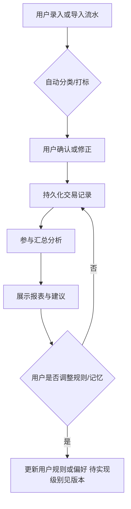
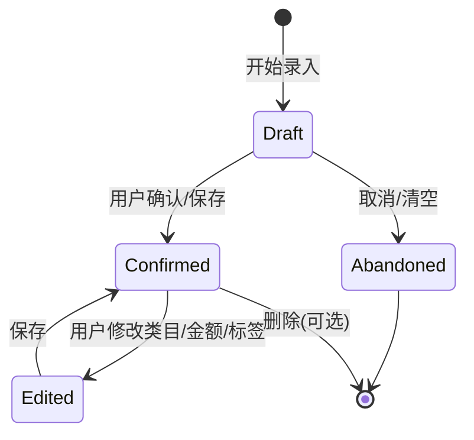
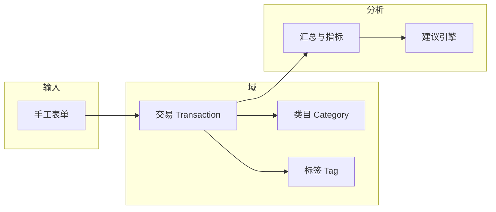
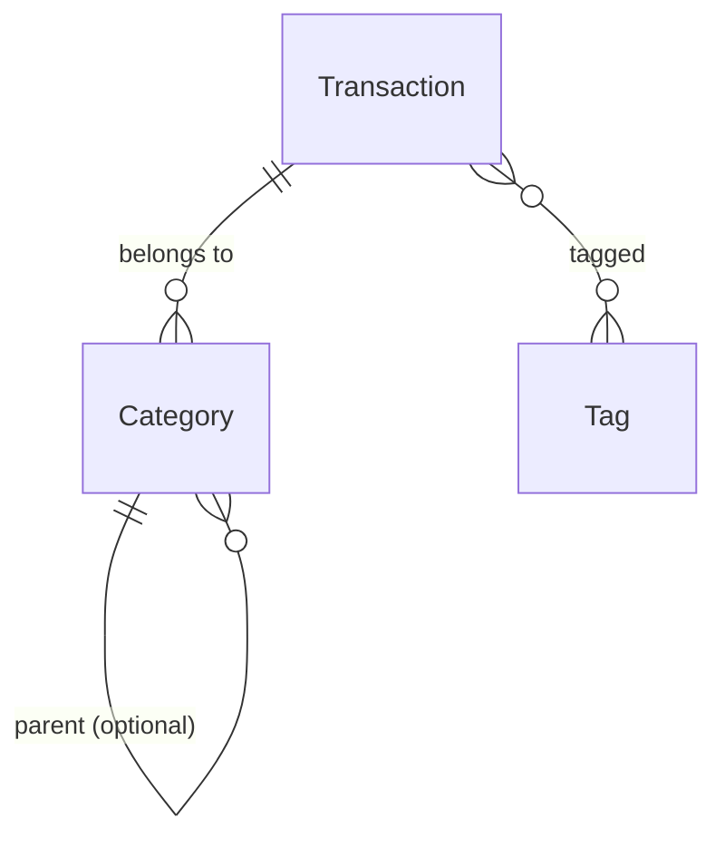

# 个人日账与智能分析（DailyBill）产品需求文档（PRD）

> **文档状态**：草案  
> **版本**：v0.1  **日期**：2026-04-22  **作者**：Agent+用户

---

## 0. 需求来源与编写说明

| 类型 | 内容 |
|------|------|
| **用户原文** | 「我现在需要开发一个工具，记录我每天的账单，能自动分类，打标签，同时还能帮我分析我的收入支出情况和建议。」（见 [input-requirement.md](input-requirement.md)） |
| **推断** | 面向个人/单用户；需支持收入与支出；「自动分类」推断为系统基于规则/模型建议类目，用户可修正；「建议」推断为可读的节支/储蓄类提示，非投资建议。 |
| **待补充** | 端形态（App/Web/小程序/桌面）及是否离线优先、是否对接银行/支付导入、多币种/多账本、与第三方登录或云同步。 |

---

## 1. 背景与目标（机会层）

### 1.1 背景与机会

个人用户在日常消费与收入记录上依赖零散手段（便签、电子表格、备忘录），**难以形成稳定分类口径与可复盘数据**。在理性消费、储蓄目标或简单家庭记账场景下，**低摩擦的日账记录**叠加**可解释的自动分类与可执行的支出洞察**，能显著降低坚持成本并提升对现金流的可控感。  
*战略/OKR 对齐：* **待补充**（若无组织目标，可视为个人工具立项）。

### 1.2 业务目标与可衡量指标

| 目标 | 指标 | 基线/目标值 | 备注 |
|------|------|-------------|------|
| 提升记账坚持率 | 月活跃天占比（MAD%） | 基线 待测 → 目标 待补充 | 需定义「完成≥1 笔记账」的口径 |
| 提高分类效率 | 自动分类被用户直接采纳率 | 待补充 | 可细分「不修改即确认」 |
| 提升洞察使用 | 周查看「分析/建议」的会话占比 | 待补充 | |
| 数据可信 | 分类与建议相关的用户显式反馈（误报/无用）率 | 低于 待补充 | 与埋点结合 |

### 1.3 不做的后果 / 做错的代价

- 若**不做**结构化记录与分类，用户无法稳定回答「钱花在哪、能否优化」，**建议**易沦为空话。  
- 若**做错**（分类武断、建议冒犯或误导），用户会放弃记录或不再信任产品，**破坏核心闭环**。

---

## 2. 问题定义

### 2.1 问题陈述（Problem Statement）

**个人用户**在 **需要回顾每日收支、理解支出结构、获得改善建议** 的场景下，遇到 **记录分散、分类耗时、缺少统一标签与分析口径** 的问题，导致 **放弃坚持记账或无法将数据转化为可行动决策**。

### 2.2 根因与 JTBD

- **5 Whys 摘要**  
  1. 为什么难坚持？→ 每次录入步骤多、分类费脑。  
  2. 为什么费脑？→ 口径不统一、历史标签混乱。  
  3. 为什么混乱？→ 缺乏自动建议与可修正的规范类目体系。  
  4. 为什么需要分析仍可做不好？→ 数据未按「收入/支出/类目/时间」结构化沉淀。  
  5. 根因可行动结论：**用结构化日账 + 可解释的自动分类与标签 + 汇总分析/建议** 闭合一最小环。

- **Jobs To Be Done**  
  「在我记下每一笔账时，帮我把账归到对的类目、打上可用标签，并让我**一眼看懂收支健康度与下一步能做什么**。」

### 2.3 How Might We

1. HMW 在**不增加录入步骤**的前提下提高分类与打标准确率？  
2. HMW 让「建议」**可解释、可关闭、不制造焦虑**？  
3. HMW 在 **V1** 内用最小数据模型支持后续银行导入与多设备同步？

---

## 3. 用户、场景与现状（洞察层）

### 3.1 用户与角色

| 角色 | 描述 | 主要诉求 | 使用频率/权重 |
|------|------|----------|---------------|
| 终端用户（个人） | 自用的记账与复盘者 | 快记、少分类成本、可看懂报表与建议 | 高 |
| 系统（分类/分析引擎） | 后台规则与/或模型 | 稳定建议类目与标签、可解释 | — |

*多租户/企业版：* **Out of Scope（V1）**。

### 3.2 用户故事（User Story）

- 作为**个人用户**，我希望**在几秒内记一笔收/支并可选备注**，以便**不中断当下动作仍能留下可追溯记录**。  
- 作为**个人用户**，我希望**系统自动给出类目/标签且我可一键改对**，以便**少打字但保持我的口径**。  
- 作为**个人用户**，我希望**在分析页看到按时间/类目的收入支出汇总与简单建议**，以便**知道是否超支、哪里可优化**。

### 3.3 核心场景与用户旅程（摘要）

1. 早晨补记昨日咖啡支出 → 输入金额与商户/备注 → 系统预填类目与标签 → 用户确认。  
2. 周末复盘 → 打开分析 → 查看周支出分布与趋势 → 阅读建议卡片。  
3. 发现错分 → 在流水列表修改类目/标签 → 后续同模式学习 **待补充**（规则/模型策略见 §4 与待确认项）。

*配图说明*：主流程与数据关系见 §4.2、§8.2 配图。

### 3.4 现状与约束

- **现状流程/系统**：**待补充**（用户目前是否用表、某 App、纯纸笔）。  
- **约束**：个人财务**敏感**；V1 应默认**本地/账号级隔离**、可导出/可删除；若含云同步，**待补充**合规与区域要求。若对接支付机构读账单，**属强集成、另立项或 V1.1+**。

---

## 4. 方案与范围（设计层）

### 4.1 产品形态与信息架构

- **端**：**待补充**（建议优先：单端 MVP，如 Web 或 App 二选一）。  
- **主导航（逻辑模块）**：记一笔 | 流水/列表 | 类目与标签 | 分析/建议 | 设置（货币、周起始日、隐私与数据）。

### 4.2 业务流程与状态

**读图目的**：说明从「发生交易」到「可分析数据」的闭环；未画账户注册、多币种换算与第三方回调。

**主流程（Mermaid）**

**交易对象状态（V1 简化）**

> 强状态：流水存在「草稿/已确认」时用于支持批量录入不立刻参与统计。若 V1 不做草稿，可仅一态「已确认」。

*若 V1 无 Draft，本图保留为**可选实现**，以 FR 与排期为准。*

**数据流（轻量）**

### 4.3 MVP 范围

**本版必须达到**

- 日粒度收支记录、基础类目、多标签。  
- 自动分类与打标（**至少规则/关键词/商户映射** 一种可落地方案；机器学习 **可选/待补充**）。  
- 收入/支出维度的**周期汇总**与**简单建议**（规则模板即可，如「某类目连续超支」）。  

**明确推迟**

- 银行/支付宝/微信**直连自动拉单**、投资顾问级建议、多人账本、复杂预算协作。  

### 4.4 方案取舍

| 项 | 方案 A | 方案 B | V1 建议 |
|----|--------|--------|---------|
| 自动分类 | 可配置规则 + 关键词 + 学习用户修正 | 端侧/云端 ML 模型 | 优先 A，验证闭环后再评估 B |
| 建议 | 规则与阈值 | 大模型长文 | 优先短规则卡；大模型 **Out of V1** 或实验特性 |

---

## 5. 功能需求（EARS）

> FR 主语为系统/产品；EARS 类型在括号中标明：Ubiquitous / Event-driven / State-driven / Unwanted / Optional。

### 5.1 功能需求列表

1. **FR-001**（Ubiquitous）系统应支持用户创建、查看、编辑与删除**单条**收支流水，字段**至少**包含：类型（收入/支出）、金额、日期、可选备注。（金额精度与货币 **待补充**）  
2. **FR-002**（Event-driven）当用户**保存**一条新流水时，系统应根据**已启用**的分类策略计算并展示**建议类目**与**建议标签**。  
3. **FR-003**（Event-driven）当用户**修改**建议类目或标签并保存时，系统应持久化用户选择，并**可选（Optional）** 将修正用于后续同类条目的建议（**实现深度待补充**）。  
4. **FR-004**（Ubiquitous）系统应提供**分析视图**，按用户选定的时间范围汇总**收入合计、支出合计、结余（若有定义）** 及**按类目的支出构成**。  
5. **FR-005**（Ubiquitous）系统应基于汇总结果生成**至少一条可读建议**（例如指出占比最高的支出类目、环比变化 **待补充** 规则表）。  
6. **FR-006**（Unwanted）若金额缺失或不可解析，系统**不得**保存流水，并应**提示**用户补全。  
7. **FR-007**（Optional）在开启「草稿」时，**State-driven** 处于「Draft」状态的流水**不纳入**全部分析汇总，直至转为「Confirmed」。（与 §4.2 二选一，以排期为准）  
8. **FR-008**（Ubiquitous）系统应允许用户**维护类目树/列表**与**标签词表**，以支撑分类与过滤。

### 5.2 用例（Use Case）摘要表

| 用例ID | 名称 | 主参与者 | 前置条件 | 成功结果 |
|--------|------|----------|----------|----------|
| UC-01 | 记一笔并采纳自动分类 | 用户 | 已登录/进入应用、类目可用 | 流水落库、分析可更新 |
| UC-02 | 修正错分 | 用户 | 存在已保存流水 | 流水更新、后续建议更可依赖 |
| UC-03 | 查看周度分析 | 用户 | 时间范围内有数据 | 展示汇总、图表/列表、建议 |

---

## 6. 业务规则

- **BR-001**：**收支方向**与金额符号约定统一（如支出为正数、收入为与支出区分字段 **待确认**），全报表口径一致。  
- **BR-002**：**默认分析周期**取用户设置或自然周/月，**起算边界**在设置中可配（周起始日 **待补充**）。  
- **BR-003**：**自动分类优先级**为：用户显式针对商户/关键词的规则 **高于** 系统默认规则 **高于** 默认类目；冲突时**显式用户规则优先**（**待补充** 细则）。  
- **BR-004**：**建议**仅基于用户已确认数据，且声明「非投资建议」若涉及储蓄表述（**合规文案待补充**）。

---

## 7. 异常、边界与错误处理

| 场景 | 系统行为 | 用户提示/日志 | 备注 |
|------|----------|----------------|------|
| 网络不可用（若在线） | 保存失败时本地队列或重试 | 「保存失败，已暂存/请重试」 | **待补充** 离线策略 |
| 无类目/标签可用 | 阻止分类完成或落到「未分类」 | 引导用户先建类目 | 与 V1 信息架构一致 |
| 数据损坏或迁移失败 | 提供导出备份入口；拒绝静默丢数 | 错误码+日志 | **待补充** |

---

## 8. 权限与数据

### 8.1 角色与权限（RBAC 或具体规则）

| 能力 | 角色/条件 | 说明 |
|------|-----------|------|
| 增删改自己的流水、类目、标签 | 本人 | V1 单用户等同「全部给本人」 |
| 导出数据 | 本人 | 建议支持 CSV/JSON **待补充** |
| 跨用户访问 | 无 | **Out of Scope V1** |

### 8.2 数据定义（关键实体/字段级摘要）

| 实体 | 关键字段/枚举 | 来源 | 约束 |
|------|----------------|------|------|
| Transaction | id, type(收入/支出), amount, occurred_at, note, category_id, tag_ids[] | 用户录入+系统推断 | 金额>0 等 **待补充** |
| Category | id, name, parent_id(可选) | 系统预置+用户 | 同名校验 |
| Tag | id, name | 用户 | 可重复引用 |

**ER（关系草图，字段以表为准）**

### 8.3 与外部系统/接口（若有）

| 系统 | 接口/同步方式 | 说明 |
|------|----------------|------|
| 无（V1） | — | 银行/支付导入 **待补充/后续** |

---

## 9. 非功能需求（NFR）

| 类型 | 要求 | 验收方式 |
|------|------|----------|
| 性能 | 单用户千级流水下列表滚动流畅（目标 **待补充** fps/时长） | 真机/性能录屏 |
| 安全/权限 | 数据默认仅本人可访问；敏感字段不明文日志 | 安全自查清单 |
| 可用性/兼容 | 核心路径≤3 步从进入到保存（**可量化**） | 走查+可用性小样本 **待补充** |
| 审计/日志 | 关键错误可定位，不含用户明文备注于第三方 **待补充** | 日志抽查 |
| 其他 | 可访问性、国际化：**待补充** | |

---

## 10. 验收标准

### 10.1 Given-When-Then

| ID | 场景 | GWT | 关联FR |
|----|------|-----|--------|
| AC-01 | 主成功-记账 | **Given** 用户已打开记一笔且类目可用，**When** 输入有效支出金额与日期并保存，**Then** 流水被持久化并出现在列表中。 | FR-001 |
| AC-02 | 自动分类展示 | **Given** 新流水含可被规则识别的备注关键词，**When** 用户保存，**Then** 系统展示与规则一致的**建议**类目/标签。 | FR-002 |
| AC-03 | 失败-缺金额 | **Given** 用户未填金额，**When** 点击保存，**Then** 系统拒绝保存并**提示**补全。 | FR-006 |
| AC-04 | 分析可出数 | **Given** 周期内存在至少一条**已确认**支出，**When** 用户打开分析并选择该周期，**Then** 展示支出合计与**至少一类**目维度汇总。 | FR-004 |
| AC-05 | 建议可读 | **Given** 分析结果可计算，**When** 用户查看建议区，**Then** 系统展示**至少一条**不空白建议文案。 | FR-005 |

### 10.2 验收清单

- [ ] 可完成「记一笔」完整路径且无崩溃  
- [ ] 自动分类/打标在规则覆盖场景下可复现通过  
- [ ] 分析页与流水数据一致（抽样核对）  
- [ ] 建议与规则表一致、可解释  
- [ ] 删除/导出/隐私项符合 §8.1 与产品承诺 **待补充**

---

## 11. 优先级、版本与成功度量

### 11.1 MoSCoW 摘要

| 需求/主题 | 分类 | 说明 |
|------------|--------|------|
| 日账 CRUD、基础类目/标签 | Must | MVP 核 |
| 自动分类/打标（可规则实现） | Must | 与用户原文一致 |
| 汇总分析+简单建议 | Must | 与用户原文一致 |
| 用户修正后「记忆」 | Should | 提升留存 |
| 草稿态与批量导入 | Could | 可排 V1.1 |
| 银行直连、大模型长文 | Won't (V1) | 见 Out of Scope |

### 11.2 本 PRD 范围与路线图

- **V1（本单）**：单用户、手工记账为主、自动分类/标签（规则优先）、分析+规则建议。  
- **V1.1+**：记忆学习、导入、云同步、更细预算。  
- **Out of Scope**：多用户协作、投资顾问、税务申报、**未确认的** 第三方强集成。

### 11.3 指标与埋点

| 指标 | 埋点/事件 | 作用 |
|------|-----------|------|
| 日活/周活 | `app_open`、**待补充** | 坚持率 |
| 记一笔成功 | `txn_saved` + 元数据 **待补充** | 核心里程碑 |
| 分类采纳 | `cat_suggested` / `cat_changed` | 调规则与体验 |
| 分析查看 | `insight_view` | 价值验证 |

### 11.4 风险与未决问题

| 风险/问题 | 影响 | 缓解/依赖 |
|------------|------|-----------|
| 端与同步未定 | 排期/架构 | 先定 V1 单端与数据层抽象 |
| 自动分类过准或过扰 | 体验 | 可解释+易改+关闭自动 |
| 建议触敏/误导 | 信任与合规 | 免责声明+人审 **待补充** |

### 11.5 需求追溯

| 业务目标 | PRD 章节/FR | 验收项 |
|----------|-------------|--------|
| 可坚持的日账 | FR-001, FR-002 | AC-01, AC-02 |
| 可信分析 | FR-004, FR-005 | AC-04, AC-05 |
| 防脏数据 | FR-006 | AC-03 |

---

*本文档为 `requirements-to-prd` 技能对 [input-requirement.md](input-requirement.md) 的示范输出，可随评审迭代。*
