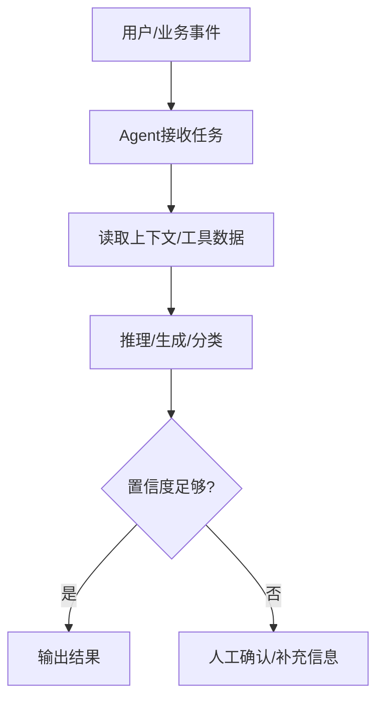
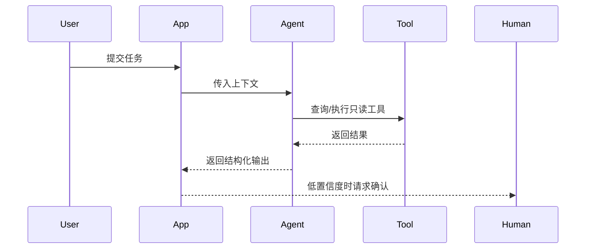

# AI PRD Patterns

Use this reference when the product includes AI, LLMs, prediction, classification, extraction, recommendation, natural-language interaction, or AI-assisted decision support.

## Classify The Product

| Type | Definition | PRD Strategy |
|------|------------|--------------|
| Traditional | Rules, forms, workflows, reports, integrations, no AI dependency | Standard PRD |
| AI-enhanced | AI improves a capability but core workflow still works without AI | Standard PRD plus AI capability subsections |
| AI-core | AI output is central to the product value or workflow | PRD plus AI solution appendix/section |

When uncertain, choose **AI-enhanced** and include a non-AI fallback.

## AI PRD Required Additions

For AI-enhanced or AI-core products, add these sections to the requirement analysis and PRD:

1. **Agent work design**: workflow, responsibilities, tools/data, human-in-the-loop, fallback.
2. **AI/Agent function list**: model/Agent capability points tied to FR/AC.
3. **Prompt design**: prompt purpose, variables, output format, safety boundaries, evaluation samples.
4. **Key sequence flow**: use Mermaid `sequenceDiagram` when Agent/model/tool/external system/human review collaborate.
5. **Quality and monitoring**: confidence, accuracy, acceptance/correction rate, unsafe output, latency, cost.

Traditional software PRDs should stay with the standard PRD structure and should not add AI/Agent sections unless AI is actually part of the solution.

## Agent Work Design

````markdown
### Agent工作设计

#### Agent工作流


#### Agent职责说明
| Agent/角色 | 职责 | 输入 | 输出 | 可用工具/数据 | 权限边界 | 失败兜底 |
|------------|------|------|------|---------------|----------|----------|

#### 关键时序流程

````

## AI/Agent Function List

```markdown
| AI/Agent功能 | 类型 | 关联FR/AC | 触发场景 | 输入 | 处理 | 输出 | 质量指标 | 失败兜底 |
|--------------|------|-----------|----------|------|------|------|----------|----------|
```

## Prompt Design In PRD

PRD prompt design should be product-level, not final engineering prompt code. Keep detailed prompt package for `prd-to-dev-spec`.

```markdown
| Prompt | 目标 | 输入变量 | 输出格式 | 安全边界 | 评估样例 |
|--------|------|----------|----------|----------|----------|
```

## AI Capability Card

Add one card per AI capability in the analysis document or PRD:

```markdown
### AI能力：{能力名}

| 项 | 内容 |
|----|------|
| 用户价值 | ... |
| 触发场景 | ... |
| 输入 | ... |
| 输出 | ... |
| 模型/机制 | 规则/LLM/分类器/检索增强/待定 |
| 置信度策略 | ... |
| 人工介入 | ... |
| 失败兜底 | ... |
| 数据与隐私 | ... |
| 评估指标 | ... |
| 监控与反馈 | ... |
```

## Hybrid AI + Traditional Pattern

Prefer layered behavior:

```text
Rules or deterministic checks
-> AI assistance for ambiguous cases
-> User/human confirmation
-> Audit log and feedback collection
-> Iteration of rules/prompts/model
```

Use this table to define ownership:

| Step | Traditional mechanism | AI mechanism | Human fallback | Output |
|------|------------------------|--------------|----------------|--------|
| ... | ... | ... | ... | ... |

## PRD Sections To Extend For AI

| PRD Section | Add |
|-------------|-----|
| Solution and scope | AI role, non-AI fallback, feature flags, rollout approach |
| Functional requirements | Trigger, input, output format, editable/reversible result |
| Business rules | Confidence thresholds, human review rules, prohibited outputs |
| Data | Input data, training/evaluation data, retention, privacy |
| Exceptions | Low confidence, timeout, unsafe output, model unavailable |
| NFR | Latency, cost, reliability, security, explainability |
| Acceptance | Accuracy/quality thresholds, fallback behavior, auditability |
| Metrics | Adoption, correction rate, user acceptance, cost per task |

## AI Acceptance Criteria

AI acceptance must include behavior and quality. Examples:

```text
Given a bill remark that matches a known merchant rule,
When the user saves the bill,
Then the system shall prefer the deterministic rule result over the AI result.

Given the AI classification confidence is below the configured threshold,
When the classification result is shown,
Then the system shall mark it as "needs confirmation" and allow manual selection.
```

For quality metrics, avoid pretending one sample proves model performance. Use:

| Metric | Example |
|--------|---------|
| Accuracy/precision/recall | Classification or extraction tasks |
| Human acceptance rate | AI suggestions adopted without correction |
| Correction rate | Users edit AI output |
| Unsafe/invalid output rate | Guardrail failures |
| Latency and cost | Online AI calls |
| Coverage | Share of cases where AI can produce usable output |

## AI Risk Checklist

- [ ] Is the AI output reversible or editable?
- [ ] Is the user told when output is AI-generated or uncertain?
- [ ] Is there a deterministic fallback for model/API failure?
- [ ] Are sensitive fields excluded from logs and prompts unless explicitly allowed?
- [ ] Are quality metrics and evaluation samples defined?
- [ ] Is there a monitoring loop for corrections, complaints, and drift?
