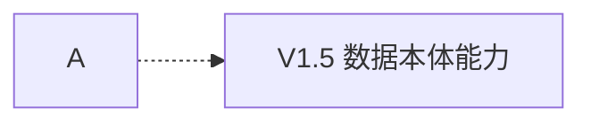

# Mermaid Compatibility Rules

Use these rules for every Mermaid diagram in requirement analysis and PRD documents.

## Hard Rules

1. Node IDs must use only English letters, digits, and underscores, such as `AgentRuntime`, `DataOntology`, or `OrderState_1`.
2. Chinese text must appear only in node display text, edge labels, notes, or participant aliases, not as node/entity/participant IDs.
3. Avoid compatibility-sensitive edge syntax such as `-.label.->`.
4. Keep `/`, brackets, colons, version numbers, decimals, and long business text out of edge labels when possible. Put them in node text or a nearby note/table.
5. In `sequenceDiagram`, participant IDs must be English and Chinese must use aliases: `participant Agent as 建模 Agent`.
6. In `erDiagram`, entity names must be English IDs. Use Chinese descriptions in nearby Markdown tables if needed.
7. Prefer simple, widely supported diagram types: `flowchart`, `sequenceDiagram`, `stateDiagram-v2`, `erDiagram`, and `classDiagram`.
8. Avoid `mindmap` unless the target renderer is known to support it; use `flowchart` as the portable fallback.

## Compatible Pattern

Avoid:

```mermaid
flowchart LR
  A -.V1.5.-> B
```

Use:



## Delivery Self-Check

- Every Mermaid block starts with ```mermaid and has a closing fence.
- The first diagram line is a valid Mermaid diagram type.
- Node/entity/participant IDs are English/digit/underscore only.
- Chinese appears in labels, aliases, or notes only.
- No edge uses high-risk syntax such as `-.label.->`.
- Punctuation-heavy content is in node text or tables, not in edge labels.
